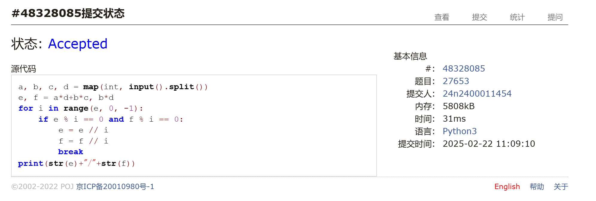
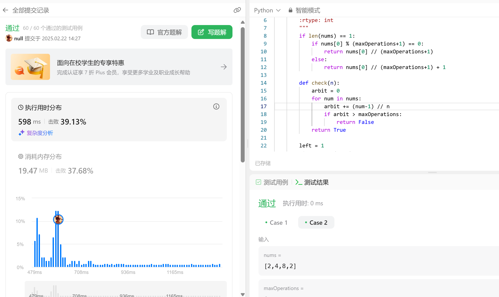
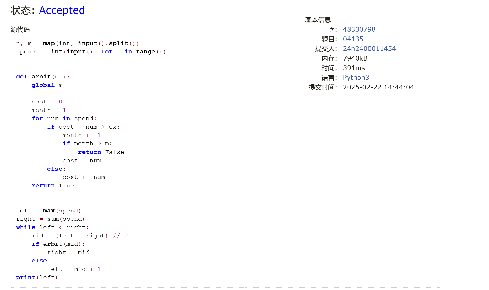
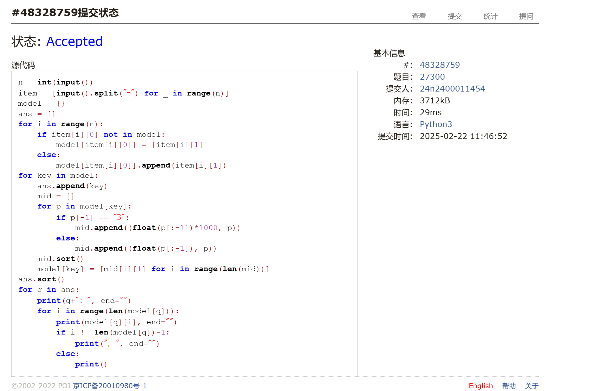

# Assignment #1: 虚拟机，Shell & 大语言模型

Updated 2309 GMT+8 Feb 20, 2025

2025 spring, Complied by <mark>金俊毅、物理学院</mark>


**作业的各项评分细则及对应的得分**

| 标准                                 | 等级                                                         | 得分 |
| ------------------------------------ | ------------------------------------------------------------ | ---- |
| 按时提交                             | 完全按时提交：1分<br/>提交有请假说明：0.5分<br/>未提交：0分  | 1 分 |
| 源码、耗时（可选）、解题思路（可选） | 提交了4个或更多题目且包含所有必要信息：1分<br/>提交了2个或以上题目但不足4个：0.5分<br/>少于2个：0分 | 1 分 |
| AC代码截图                           | 提交了4个或更多题目且包含所有必要信息：1分<br/>提交了2个或以上题目但不足4个：0.5分<br/>少于：0分 | 1 分 |
| 清晰头像、PDF文件、MD/DOC附件        | 包含清晰的Canvas头像、PDF文件以及MD或DOC格式的附件：1分<br/>缺少上述三项中的任意一项：0.5分<br/>缺失两项或以上：0分 | 1 分 |
| 学习总结和个人收获                   | 提交了学习总结和个人收获：1分<br/>未提交学习总结或内容不详：0分 | 1 分 |
| 总得分： 5                           | 总分满分：5分                                                |      |
>
> 
>
> **说明：**
>
> 1. **解题与记录：**
>       - 对于每一个题目，请提供其解题思路（可选），并附上使用Python或C++编写的源代码（确保已在OpenJudge， Codeforces，LeetCode等平台上获得Accepted）。请将这些信息连同显示“Accepted”的截图一起填写到下方的作业模板中。（推荐使用Typora https://typoraio.cn 进行编辑，当然你也可以选择Word。）无论题目是否已通过，请标明每个题目大致花费的时间。
>    
>2. **课程平台与提交安排：**
> 
>   - 我们的课程网站位于Canvas平台（https://pku.instructure.com ）。该平台将在第2周选课结束后正式启用。在平台启用前，请先完成作业并将作业妥善保存。待Canvas平台激活后，再上传你的作业。
> 
>       - 提交时，请首先上传PDF格式的文件，并将.md或.doc格式的文件作为附件上传至右侧的“作业评论”区。确保你的Canvas账户有一个清晰可见的头像，提交的文件为PDF格式，并且“作业评论”区包含上传的.md或.doc附件。
> 
>3. **延迟提交：**
> 
>   - 如果你预计无法在截止日期前提交作业，请提前告知具体原因。这有助于我们了解情况并可能为你提供适当的延期或其他帮助。 
> 
>请按照上述指导认真准备和提交作业，以保证顺利完成课程要求。


## 1. 题目

### 27653: Fraction类

http://cs101.openjudge.cn/practice/27653/
代码：

```python
a, b, c, d = map(int, input().split())
e, f = a*d+b*c, b*d
for i in range(e, 0, -1):
    if e % i == 0 and f % i == 0:
        e = e // i
        f = f // i
        break
print(str(e)+"/"+str(f))
```


代码运行截图 <mark>（至少包含有"Accepted"）</mark>



### 1760.袋子里最少数目的球

 https://leetcode.cn/problems/minimum-limit-of-balls-in-a-bag/
代码：

```python
class Solution(object):
    def minimumSize(self, nums, maxOperations):
        """
        :type nums: List[int]
        :type maxOperations: int
        :rtype: int
        """
        if len(nums) == 1:
            if nums[0] % (maxOperations+1) == 0:
                return nums[0] // (maxOperations+1)
            else:
                return nums[0] // (maxOperations+1) + 1
        
        def check(n):
            arbit = 0
            for num in nums:
                arbit += (num-1) // n
                if arbit > maxOperations:
                    return False
            return True
        
        left = 1
        right = max(nums)
        while left < right:
            mid = (left + right) // 2
            if check(mid):
                right = mid
            else:
                left = mid + 1

        return left 
```


代码运行截图 <mark>（至少包含有"Accepted"）</mark>



### 04135: 月度开销

http://cs101.openjudge.cn/practice/04135
代码：

```python
n, m = map(int, input().split())
spend = [int(input()) for _ in range(n)]


def arbit(ex):
    global m

    cost = 0
    month = 1
    for num in spend:
        if cost + num > ex:
            month += 1
            if month > m:
                return False
            cost = num
        else:
            cost += num
    return True


left = max(spend)
right = sum(spend)
while left < right:
    mid = (left + right) // 2
    if arbit(mid):
        right = mid
    else:
        left = mid + 1
print(left)
```


代码运行截图 <mark>（至少包含有"Accepted"）</mark>



### 27300: 模型整理

http://cs101.openjudge.cn/practice/27300/
代码：

```python
n = int(input())
item = [input().split("-") for _ in range(n)]
model = {}
ans = []
for i in range(n):
    if item[i][0] not in model:
        model[item[i][0]] = [item[i][1]]
    else:
        model[item[i][0]].append(item[i][1])
for key in model:
    ans.append(key)
    mid = []
    for p in model[key]:
        if p[-1] == "B":
            mid.append((float(p[:-1])*1000, p))
        else:
            mid.append((float(p[:-1]), p))
    mid.sort()
    model[key] = [mid[i][1] for i in range(len(mid))]
ans.sort()
for q in ans:
    print(q+": ", end="")
    for i in range(len(model[q])):
        print(model[q][i], end="")
        if i != len(model[q])-1:
            print(", ", end="")
        else:
            print()
```


代码运行截图 <mark>（至少包含有"Accepted"）</mark>



### Q5. 大语言模型（LLM）部署与测试

本任务旨在本地环境或通过云虚拟机（如 https://clab.pku.edu.cn/ 提供的资源）部署大语言模型（LLM）并进行测试。用户界面方面，可以选择使用图形界面工具如 https://lmstudio.ai 或命令行界面如 https://www.ollama.com 来完成部署工作。

测试内容包括选择若干编程题目，确保这些题目能够在所部署的LLM上得到正确解答，并通过所有相关的测试用例（即状态为Accepted）。选题应来源于在线判题平台，例如 OpenJudge、Codeforces、LeetCode 或洛谷等，同时需注意避免与已找到的AI接受题目重复。已有的AI接受题目列表可参考以下链接：
https://github.com/GMyhf/2025spring-cs201/blob/main/AI_accepted_locally.md

请提供你的最新进展情况，包括任何关键步骤的截图以及遇到的问题和解决方案。这将有助于全面了解项目的推进状态，并为进一步的工作提供参考。


### Q6. 阅读《Build a Large Language Model (From Scratch)》第一章

作者：Sebastian Raschka

请整理你的学习笔记。这应该包括但不限于对第一章核心概念的理解、重要术语的解释、你认为特别有趣或具有挑战性的内容，以及任何你可能有的疑问或反思。通过这种方式，不仅能巩固你自己的学习成果，也能帮助他人更好地理解这一部分内容。


## 2. 学习总结和个人收获

寒假里跟着做了一些每日选做，学了一些内容，开学初别的活有点多，大模型还没有整。


