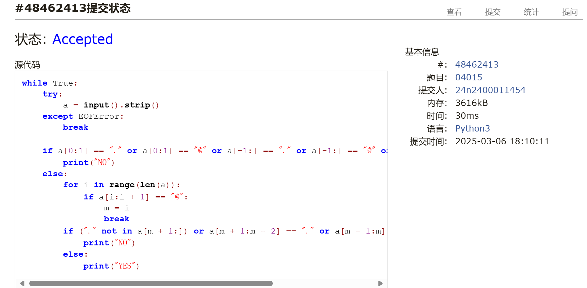
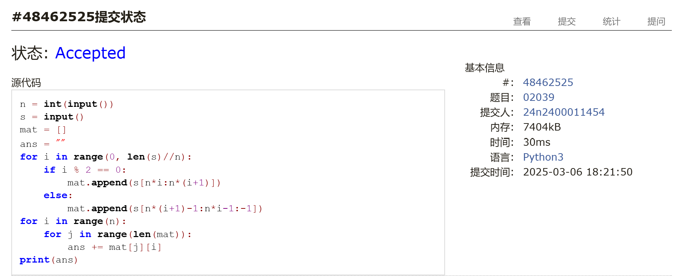
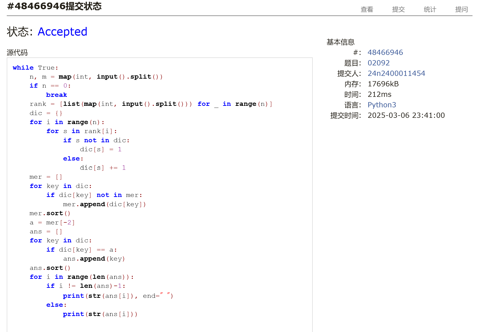
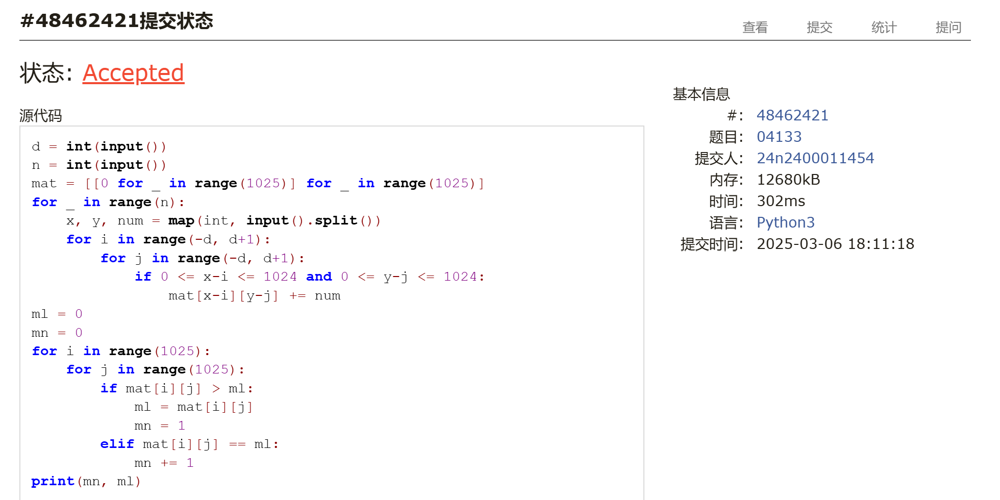
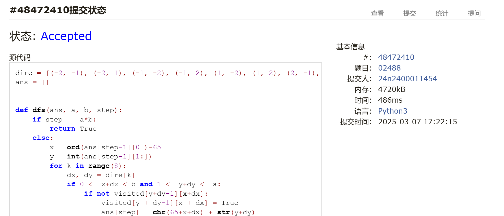
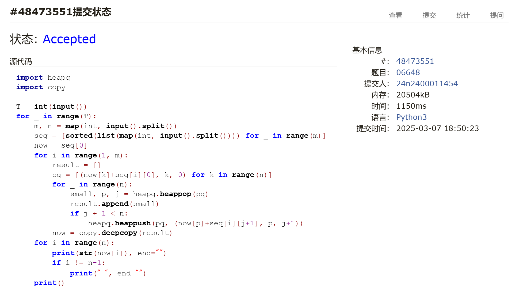

# Assignment #3: 惊蛰 Mock Exam

Updated 1641 GMT+8 Mar 5, 2025

2025 spring, Complied by <mark>金俊毅，物理学院</mark>


> **说明：**
>
> 1. **惊蛰⽉考**：AC6<mark>（请改为同学的通过数）</mark> 。考试题⽬都在“题库（包括计概、数算题目）”⾥⾯，按照数字题号能找到，可以重新提交。作业中提交⾃⼰最满意版本的代码和截图。
>
> 2. **解题与记录：**
>
>    对于每一个题目，请提供其解题思路（可选），并附上使用Python或C++编写的源代码（确保已在OpenJudge， Codeforces，LeetCode等平台上获得Accepted）。请将这些信息连同显示“Accepted”的截图一起填写到下方的作业模板中。（推荐使用Typora https://typoraio.cn 进行编辑，当然你也可以选择Word。）无论题目是否已通过，请标明每个题目大致花费的时间。
>
> 3. **提交安排：**提交时，请首先上传PDF格式的文件，并将.md或.doc格式的文件作为附件上传至右侧的“作业评论”区。确保你的Canvas账户有一个清晰可见的头像，提交的文件为PDF格式，并且“作业评论”区包含上传的.md或.doc附件。
>
> 4. **延迟提交：**如果你预计无法在截止日期前提交作业，请提前告知具体原因。这有助于我们了解情况并可能为你提供适当的延期或其他帮助。 
>
> 请按照上述指导认真准备和提交作业，以保证顺利完成课程要求。


## 1. 题目

### E04015: 邮箱验证

strings, http://cs101.openjudge.cn/practice/04015
代码：

```python
while True:
    try:
        a = input().strip()
    except EOFError:
        break

    if a[0:1] == "." or a[0:1] == "@" or a[-1:] == "." or a[-1:] == "@" or ("@" not in a):
        print("NO")
    else:
        for i in range(len(a)):
            if a[i:i + 1] == "@":
                m = i
                break
        if ("." not in a[m + 1:]) or a[m + 1:m + 2] == "." or a[m - 1:m] == "." or ("@" in a[m + 1:]):
            print("NO")
        else:
            print("YES")
```


代码运行截图 <mark>（至少包含有"Accepted"）</mark>



### M02039: 反反复复

implementation, http://cs101.openjudge.cn/practice/02039/
代码：

```python
n = int(input())
s = input()
mat = []
ans = ""
for i in range(0, len(s)//n):
    if i % 2 == 0:
        mat.append(s[n*i:n*(i+1)])
    else:
        mat.append(s[n*(i+1)-1:n*i-1:-1])
for i in range(n):
    for j in range(len(mat)):
        ans += mat[j][i]
print(ans)
```


代码运行截图 <mark>（至少包含有"Accepted"）</mark>



### M02092: Grandpa is Famous

implementation, http://cs101.openjudge.cn/practice/02092/
代码：

```python
while True:
    n, m = map(int, input().split())
    if n == 0:
        break
    rank = [list(map(int, input().split())) for _ in range(n)]
    dic = {}
    for i in range(n):
        for s in rank[i]:
            if s not in dic:
                dic[s] = 1
            else:
                dic[s] += 1
    mer = []
    for key in dic:
        if dic[key] not in mer:
            mer.append(dic[key])
    mer.sort()
    a = mer[-2]
    ans = []
    for key in dic:
        if dic[key] == a:
            ans.append(key)
    ans.sort()
    for i in range(len(ans)):
        if i != len(ans)-1:
            print(str(ans[i]), end=" ")
        else:
            print(str(ans[i]))
```


代码运行截图 <mark>（至少包含有"Accepted"）</mark>



### M04133: 垃圾炸弹

matrices, http://cs101.openjudge.cn/practice/04133/
代码：

```python
d = int(input())
n = int(input())
mat = [[0 for _ in range(1025)] for _ in range(1025)]
for _ in range(n):
    x, y, num = map(int, input().split())
    for i in range(-d, d+1):
        for j in range(-d, d+1):
            if 0 <= x-i <= 1024 and 0 <= y-j <= 1024:
                mat[x-i][y-j] += num
ml = 0
mn = 0
for i in range(1025):
    for j in range(1025):
        if mat[i][j] > ml:
            ml = mat[i][j]
            mn = 1
        elif mat[i][j] == ml:
            mn += 1
print(mn, ml)
```


代码运行截图 <mark>（至少包含有"Accepted"）</mark>



### T02488: A Knight's Journey

backtracking, http://cs101.openjudge.cn/practice/02488/
代码：

```python
dire = [(-2, -1), (-2, 1), (-1, -2), (-1, 2), (1, -2), (1, 2), (2, -1), (2, 1)]
ans = []


def dfs(ans, a, b, step):
    if step == a*b:
        return True
    else:
        x = ord(ans[step-1][0])-65
        y = int(ans[step-1][1:])
        for k in range(8):
            dx, dy = dire[k]
            if 0 <= x+dx < b and 1 <= y+dy <= a:
                if not visited[y+dy-1][x+dx]:
                    visited[y + dy-1][x + dx] = True
                    ans[step] = chr(65+x+dx) + str(y+dy)
                    if dfs(ans, a, b, step+1):
                        return True
                    visited[y + dy - 1][x + dx] = False
        return False


n = int(input())
for qw in range(n):
    p, q = map(int, input().split())
    ans = ["" for _ in range(p*q)]
    result = ""
    print("Scenario #"+str(qw+1)+":")
    for j in range(q):
        for i in range(1, p+1):
            ans[0] = chr(65+j) + str(i)
            visited = [[False for _ in range(q)] for _ in range(p)]
            visited[i-1][j] = True
            if dfs(ans, p, q, 1):
                result = "".join(ans)
                break
        if result:
            break
    if result:
        print(result)
    else:
        print("impossible")
    if qw != n-1:
        print()
```


代码运行截图 <mark>（至少包含有"Accepted"）</mark>



### T06648: Sequence

heap, http://cs101.openjudge.cn/practice/06648/
代码：

```python
import heapq
import copy

T = int(input())
for _ in range(T):
    m, n = map(int, input().split())
    seq = [sorted(list(map(int, input().split()))) for _ in range(m)]
    now = seq[0]
    for i in range(1, m):
        result = []
        pq = [(now[k]+seq[i][0], k, 0) for k in range(n)]
        for _ in range(n):
            small, p, j = heapq.heappop(pq)
            result.append(small)
            if j + 1 < n:
                heapq.heappush(pq, (now[p]+seq[i][j+1], p, j+1))
        now = copy.deepcopy(result)
    for i in range(n):
        print(str(now[i]), end="")
        if i != n-1:
            print(" ", end="")
    print()
```


代码运行截图 ==（AC代码截图，至少包含有"Accepted"）==



## 2. 学习总结和收获

骑士周游的思路算是学到了，直接选择字典序最小的路径，不用把所有路径找到（这样似乎会超时），算是新学到了一些。


