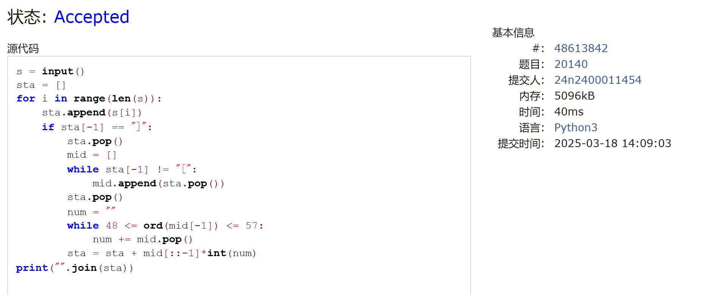
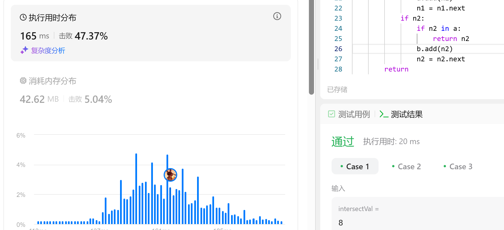
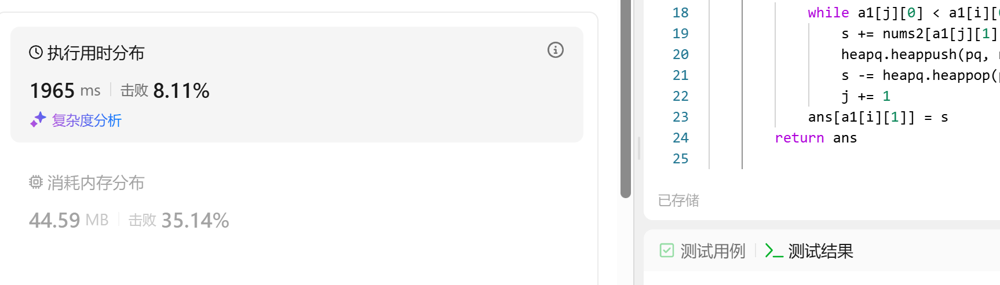

# Assignment #4: 位操作、栈、链表、堆和NN

Updated 1203 GMT+8 Mar 10, 2025

2025 spring, Complied by <mark>金俊毅，物理学院</mark>


> **说明：**
>
> 1. **解题与记录：**
>
>    对于每一个题目，请提供其解题思路（可选），并附上使用Python或C++编写的源代码（确保已在OpenJudge， Codeforces，LeetCode等平台上获得Accepted）。请将这些信息连同显示“Accepted”的截图一起填写到下方的作业模板中。（推荐使用Typora https://typoraio.cn 进行编辑，当然你也可以选择Word。）无论题目是否已通过，请标明每个题目大致花费的时间。
>
> 2. **提交安排：**提交时，请首先上传PDF格式的文件，并将.md或.doc格式的文件作为附件上传至右侧的“作业评论”区。确保你的Canvas账户有一个清晰可见的头像，提交的文件为PDF格式，并且“作业评论”区包含上传的.md或.doc附件。
>
> 3. **延迟提交：**如果你预计无法在截止日期前提交作业，请提前告知具体原因。这有助于我们了解情况并可能为你提供适当的延期或其他帮助。 
>
> 请按照上述指导认真准备和提交作业，以保证顺利完成课程要求。


## 1. 题目

### 136.只出现一次的数字

bit manipulation, https://leetcode.cn/problems/single-number/


<mark>请用位操作来实现，并且只使用常量额外空间。</mark>


代码：

```python
class Solution(object):
    def singleNumber(self, nums):
        """
        :type nums: List[int]
        :rtype: int
        """
        n = len(nums)
        ans = nums[0]
        for i in range(1, n):
            ans ^= nums[i]
        return ans
```


代码运行截图 <mark>（至少包含有"Accepted"）</mark>


### 20140:今日化学论文

stack, http://cs101.openjudge.cn/practice/20140/

代码：

```python
s = input()
sta = []
for i in range(len(s)):
    sta.append(s[i])
    if sta[-1] == "]":
        sta.pop()
        mid = []
        while sta[-1] != "[":
            mid.append(sta.pop())
        sta.pop()
        num = ""
        while 48 <= ord(mid[-1]) <= 57:
            num += mid.pop()
        sta = sta + mid[::-1]*int(num)
print("".join(sta))
```


代码运行截图 <mark>（至少包含有"Accepted"）</mark>



### 160.相交链表

linked list, https://leetcode.cn/problems/intersection-of-two-linked-lists/

代码：

```python
# Definition for singly-linked list.
# class ListNode(object):
#     def __init__(self, x):
#         self.val = x
#         self.next = None

class Solution(object):
    def getIntersectionNode(self, headA, headB):
        """
        :type head1, head1: ListNode
        :rtype: ListNode
        """
        a = set()
        b = set()
        n1 = headA
        n2 = headB
        while n1 or n2:
            if n1:
                if n1 in b:
                    return n1
                a.add(n1)
                n1 = n1.next
            if n2:
                if n2 in a:
                    return n2
                b.add(n2)
                n2 = n2.next
        return
```


代码运行截图 <mark>（至少包含有"Accepted"）</mark>



### 206.反转链表

linked list, https://leetcode.cn/problems/reverse-linked-list/
代码：

```python
# Definition for singly-linked list.
# class ListNode(object):
#     def __init__(self, val=0, next=None):
#         self.val = val
#         self.next = next
class Solution(object):
    def reverseList(self, head):
        """
        :type head: Optional[ListNode]
        :rtype: Optional[ListNode]
        """
        point = None
        current = head
        while current:
            new = current.next
            current.next = point
            point = current
            current = new
        return point
        
```


代码运行截图 <mark>（至少包含有"Accepted"）</mark>


### 3478.选出和最大的K个元素

heap, https://leetcode.cn/problems/choose-k-elements-with-maximum-sum/


代码：

```python
import heapq

class Solution(object):
    def findMaxSum(self, nums1, nums2, k):
        """
        :type nums1: List[int]
        :type nums2: List[int]
        :type k: int
        :rtype: List[int]
        """
        n = len(nums1)
        ans = [0 for _ in range(n)]
        pq = [0 for _ in range(k)]
        a1 = sorted([(nums1[i], i) for i in range(n)])
        s = 0
        j = 0
        for i in range(n):
            while a1[j][0] < a1[i][0]:
                s += nums2[a1[j][1]]
                heapq.heappush(pq, nums2[a1[j][1]])
                s -= heapq.heappop(pq)
                j += 1
            ans[a1[i][1]] = s
        return ans
```


代码运行截图 <mark>（至少包含有"Accepted"）</mark>



### Q6.交互可视化neural network

https://developers.google.com/machine-learning/crash-course/neural-networks/interactive-exercises

**Your task:** configure a neural network that can separate the orange dots from the blue dots in the diagram, achieving a loss of less than 0.2 on both the training and test data.

**Instructions:**

In the interactive widget:

1. Modify the neural network hyperparameters by experimenting with some of the following config settings:
   - Add or remove hidden layers by clicking the **+** and **-** buttons to the left of the **HIDDEN LAYERS** heading in the network diagram.
   - Add or remove neurons from a hidden layer by clicking the **+** and **-** buttons above a hidden-layer column.
   - Change the learning rate by choosing a new value from the **Learning rate** drop-down above the diagram.
   - Change the activation function by choosing a new value from the **Activation** drop-down above the diagram.
2. Click the Play button above the diagram to train the neural network model using the specified parameters.
3. Observe the visualization of the model fitting the data as training progresses, as well as the **Test loss** and **Training loss** values in the **Output** section.
4. If the model does not achieve loss below 0.2 on the test and training data, click reset, and repeat steps 1–3 with a different set of configuration settings. Repeat this process until you achieve the preferred results.

给出满足约束条件的<mark>截图</mark>，并说明学习到的概念和原理。


## 2. 学习总结和收获

对于第2题这种括号的操作再次熟悉了一下，以前一直做不太来；新学到了第5题这种维护和值的思想。


