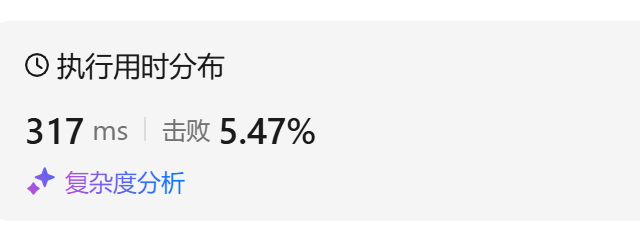
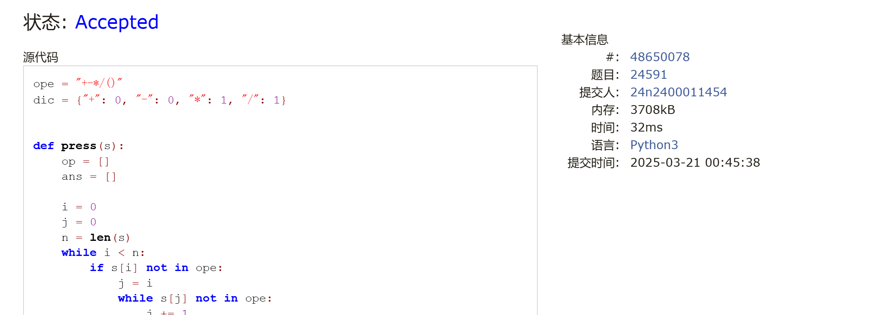
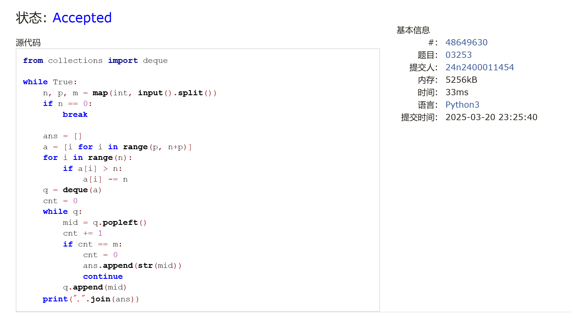
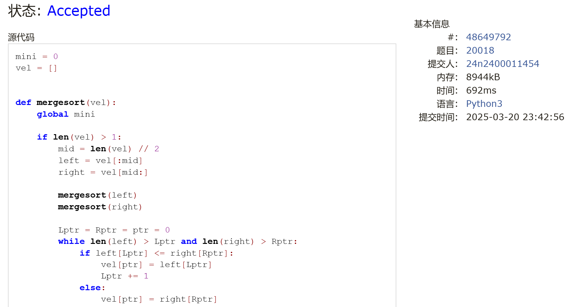

# Assignment #5: 链表、栈、队列和归并排序

Updated 1348 GMT+8 Mar 17, 2025

2025 spring, Complied by <mark>金俊毅，物理学院</mark>


> **说明：**
>
> 1. **解题与记录：**
>
>    对于每一个题目，请提供其解题思路（可选），并附上使用Python或C++编写的源代码（确保已在OpenJudge， Codeforces，LeetCode等平台上获得Accepted）。请将这些信息连同显示“Accepted”的截图一起填写到下方的作业模板中。（推荐使用Typora https://typoraio.cn 进行编辑，当然你也可以选择Word。）无论题目是否已通过，请标明每个题目大致花费的时间。
>
> 2. **提交安排：**提交时，请首先上传PDF格式的文件，并将.md或.doc格式的文件作为附件上传至右侧的“作业评论”区。确保你的Canvas账户有一个清晰可见的头像，提交的文件为PDF格式，并且“作业评论”区包含上传的.md或.doc附件。
>
> 3. **延迟提交：**如果你预计无法在截止日期前提交作业，请提前告知具体原因。这有助于我们了解情况并可能为你提供适当的延期或其他帮助。 
>
> 请按照上述指导认真准备和提交作业，以保证顺利完成课程要求。


## 1. 题目

### LC21.合并两个有序链表

linked list, https://leetcode.cn/problems/merge-two-sorted-lists/
代码：

```python
class Solution(object):
    def mergeTwoLists(self, list1, list2):
        """
        :type list1: Optional[ListNode]
        :type list2: Optional[ListNode]
        :rtype: Optional[ListNode]
        """
        root = ListNode(-101)
        node = root

        while list1 and list2:
            if list1.val <= list2.val:
                node.next = list1
                list1 = list1.next
            else:
                node.next = list2
                list2 = list2.next
            node = node.next
        
        if list1:
            node.next = list1
        if list2:
            node.next = list2
        
        return root.next
```


代码运行截图 <mark>（至少包含有"Accepted"）</mark>


### LC234.回文链表

linked list, https://leetcode.cn/problems/palindrome-linked-list/

<mark>请用快慢指针实现。</mark>


代码：

```python
class Solution(object):
    def isPalindrome(self, head):
        """
        :type head: Optional[ListNode]
        :rtype: bool
        """
        if not head or not head.next:
            return True
        
        # 1. 使用快慢指针找到链表的中点
        slow, fast = head, head
        while fast and fast.next:
            slow = slow.next
            fast = fast.next.next
        
        # 2. 反转链表的后半部分
        prev = None
        while slow:
            next_node = slow.next
            slow.next = prev
            prev = slow
            slow = next_node
        
        # 3. 对比前半部分和反转后的后半部分
        left, right = head, prev
        while right:  # right 是反转后的链表的头
            if left.val != right.val:
                return False
            left = left.next
            right = right.next
        
        return True
```


代码运行截图 <mark>（至少包含有"Accepted"）</mark>


### LC1472.设计浏览器历史记录

doubly-lined list, https://leetcode.cn/problems/design-browser-history/

<mark>请用双链表实现。</mark>


代码：

```python
class ListNode:
    def __init__(self, url):
        self.url = url
        self.next = None
        self.pre = None

class BrowserHistory(object):

    def __init__(self, homepage):
        """
        :type homepage: str
        """
        self.current = ListNode(homepage)


    def visit(self, url):
        """
        :type url: str
        :rtype: None
        """
        self.current.next = ListNode(url)
        self.current.next.pre = self.current
        self.current = self.current.next
        

    def back(self, steps):
        """
        :type steps: int
        :rtype: str
        """
        for _ in range(steps):
            if not self.current.pre:
                return self.current.url
            self.current = self.current.pre
        return self.current.url
        

    def forward(self, steps):
        """
        :type steps: int
        :rtype: str
        """
        for _ in range(steps):
            if not self.current.next:
                return self.current.url
            self.current = self.current.next
        return self.current.url
```


代码运行截图 <mark>（至少包含有"Accepted"）</mark>



### 24591: 中序表达式转后序表达式

stack, http://cs101.openjudge.cn/practice/24591/
代码：

```python
ope = "+-*/()"
dic = {"+": 0, "-": 0, "*": 1, "/": 1}


def press(s):
    op = []
    ans = []

    i = 0
    j = 0
    n = len(s)
    while i < n:
        if s[i] not in ope:
            j = i
            while s[j] not in ope:
                j += 1
                if j == n:
                    break
            ans.append(s[i:j])
            i = j
            if i == n:
                break

        if s[i] == "(":
            op.append("(")
        elif s[i] == ")":
            while op[-1] != "(":
                ans.append(op.pop())
            op.pop()
        elif op:
            while op and op[-1] != '(' and dic[s[i]] <= dic[op[-1]]:
                ans.append(op.pop())
            op.append(s[i])
        else:
            op.append(s[i])
        i += 1
    while op:
        if op[-1] != "(":
            ans.append(op.pop())
        else:
            op.pop()
    return " ".join(ans)


y = int(input())
for _ in range(y):
    print(press(input()))
```


代码运行截图 <mark>（至少包含有"Accepted"）</mark>



### 03253: 约瑟夫问题No.2

queue, http://cs101.openjudge.cn/practice/03253/

<mark>请用队列实现。</mark>


代码：

```python
from collections import deque

while True:
    n, p, m = map(int, input().split())
    if n == 0:
        break

    ans = []
    a = [i for i in range(p, n+p)]
    for i in range(n):
        if a[i] > n:
            a[i] -= n
    q = deque(a)
    cnt = 0
    while q:
        mid = q.popleft()
        cnt += 1
        if cnt == m:
            cnt = 0
            ans.append(str(mid))
            continue
        q.append(mid)
    print(",".join(ans))
```


代码运行截图 <mark>（至少包含有"Accepted"）</mark>



### 20018: 蚂蚁王国的越野跑

merge sort, http://cs101.openjudge.cn/practice/20018/

代码：

```python
mini = 0
vel = []


def mergesort(vel):
    global mini

    if len(vel) > 1:
        mid = len(vel) // 2
        left = vel[:mid]
        right = vel[mid:]

        mergesort(left)
        mergesort(right)

        Lptr = Rptr = ptr = 0
        while len(left) > Lptr and len(right) > Rptr:
            if left[Lptr] <= right[Rptr]:
                vel[ptr] = left[Lptr]
                Lptr += 1
            else:
                vel[ptr] = right[Rptr]
                Rptr += 1
                mini += len(left) - Lptr
            ptr += 1

        while len(left) > Lptr:
            vel[ptr] = left[Lptr]
            ptr += 1
            Lptr += 1
        while len(right) > Rptr:
            vel[ptr] = right[Rptr]
            ptr += 1
            Rptr += 1


mini = 0
n = int(input())
vel = [int(input()) for _ in range(n)][::-1]
mergesort(vel)
print(mini)
```


代码运行截图 <mark>（至少包含有"Accepted"）</mark>



## 2. 学习总结和收获

复习了一遍归并排序，总算是啃下了表达式转化这个骨头，之前的理解一直不是很好。


