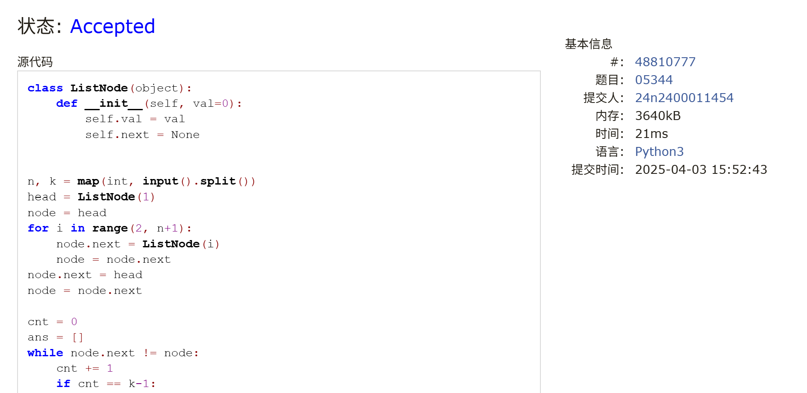
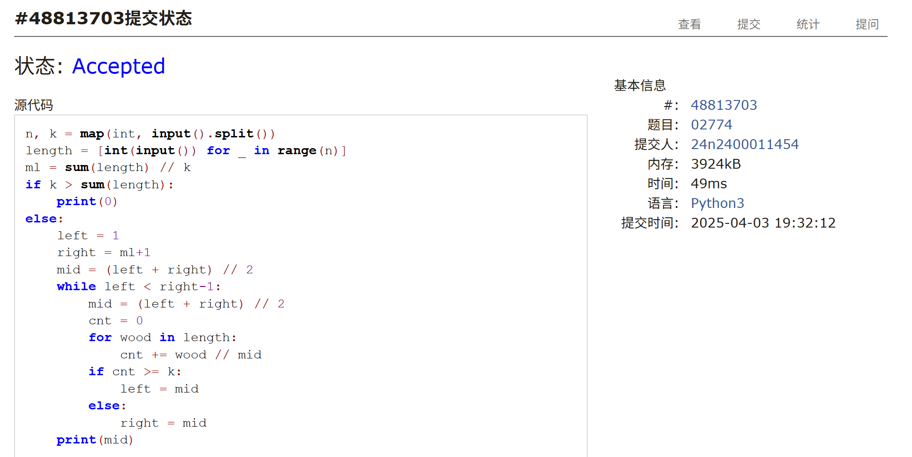
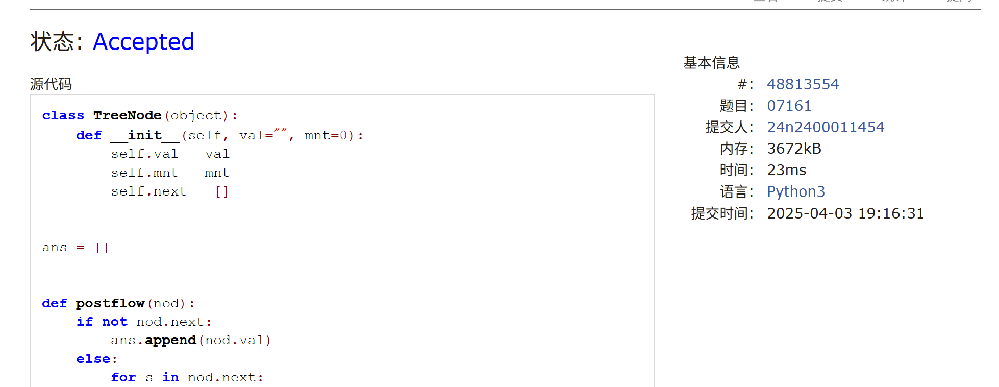
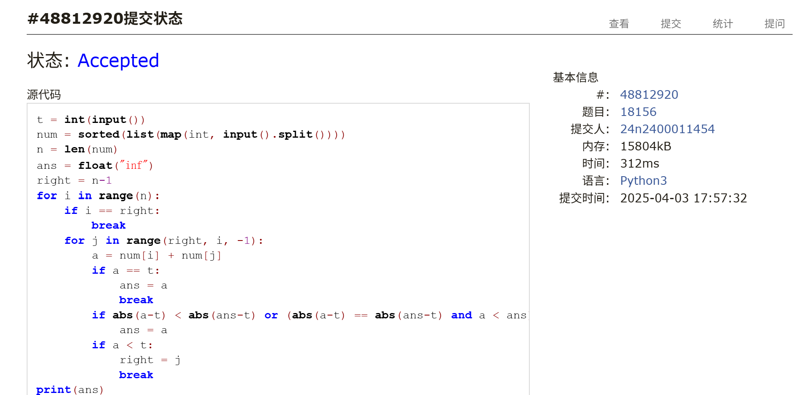
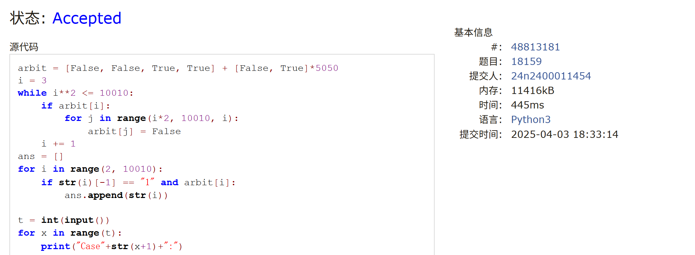
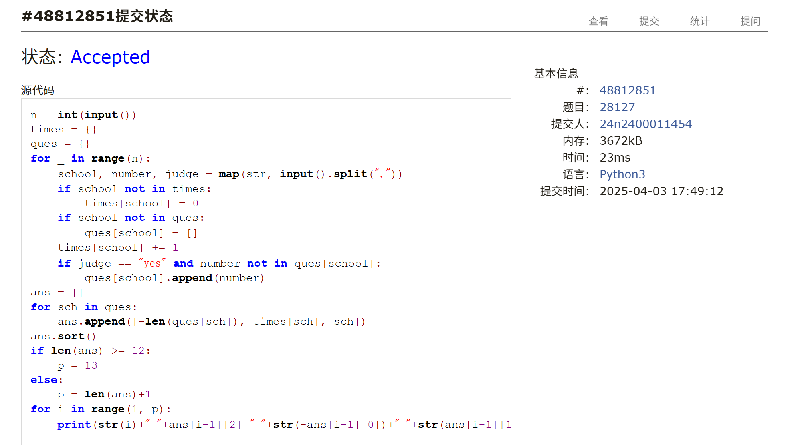

# Assignment #7: 20250402 Mock Exam

Updated 1624 GMT+8 Apr 2, 2025

2025 spring, Complied by <mark>金俊毅，物理学院</mark>


## 1. 题目

### E05344:最后的最后

http://cs101.openjudge.cn/practice/05344/
代码：

```python
class ListNode(object):
    def __init__(self, val=0):
        self.val = val
        self.next = None


n, k = map(int, input().split())
head = ListNode(1)
node = head
for i in range(2, n+1):
    node.next = ListNode(i)
    node = node.next
node.next = head
node = node.next

cnt = 0
ans = []
while node.next != node:
    cnt += 1
    if cnt == k-1:
        ans.append(str(node.next.val))
        node.next = node.next.next
        cnt = 0
    node = node.next
print(" ".join(ans))
```


代码运行截图 <mark>（至少包含有"Accepted"）</mark>



### M02774: 木材加工

binary search, http://cs101.openjudge.cn/practice/02774/

代码：

```python
n, k = map(int, input().split())
length = [int(input()) for _ in range(n)]
ml = sum(length) // k
if k > sum(length):
    print(0)
else:
    left = 1
    right = ml+1
    mid = (left + right) // 2
    while left < right-1:
        mid = (left + right) // 2
        cnt = 0
        for wood in length:
            cnt += wood // mid
        if cnt >= k:
            left = mid
        else:
            right = mid
    print(mid)
```


代码运行截图 <mark>（至少包含有"Accepted"）</mark>



### M07161:森林的带度数层次序列存储

tree, http://cs101.openjudge.cn/practice/07161/
代码：

```python
class TreeNode(object):
    def __init__(self, val="", mnt=0):
        self.val = val
        self.mnt = mnt
        self.next = []


ans = []


def postflow(nod):
    if not nod.next:
        ans.append(nod.val)
    else:
        for s in nod.next:
            postflow(s)
        ans.append(nod.val)


n = int(input())
forests = []
heads = []
for _ in range(n):
    tree = input().split()
    head = TreeNode(tree[0], int(tree[1]))
    forest = [[head]]
    heads.append(head)
    i = 2
    while i < len(tree):
        a = forest[-1]
        forest.append([])
        for node in a:
            for _ in range(node.mnt):
                node.next.append(TreeNode(tree[i], int(tree[i+1])))
                i += 2
                forest[-1].append(node.next[-1])
for p in heads:
    postflow(p)
print(" ".join(ans))

```


代码运行截图 <mark>（至少包含有"Accepted"）</mark>



### M18156:寻找离目标数最近的两数之和

two pointers, http://cs101.openjudge.cn/practice/18156/

代码：

```python
t = int(input())
num = sorted(list(map(int, input().split())))
n = len(num)
ans = float("inf")
right = n-1
for i in range(n):
    if i == right:
        break
    for j in range(right, i, -1):
        a = num[i] + num[j]
        if a == t:
            ans = a
            break
        if abs(a-t) < abs(ans-t) or (abs(a-t) == abs(ans-t) and a < ans):
            ans = a
        if a < t:
            right = j
            break
print(ans)
```


代码运行截图 <mark>（至少包含有"Accepted"）</mark>



### M18159:个位为 1 的质数个数

sieve, http://cs101.openjudge.cn/practice/18159/
代码：

```python
arbit = [False, False, True, True] + [False, True]*5050
i = 3
while i**2 <= 10010:
    if arbit[i]:
        for j in range(i*2, 10010, i):
            arbit[j] = False
    i += 1
ans = []
for i in range(2, 10010):
    if str(i)[-1] == "1" and arbit[i]:
        ans.append(str(i))

t = int(input())
for x in range(t):
    print("Case"+str(x+1)+":")
    n = int(input())
    p = len(ans)
    if n <= 11:
        print("NULL")
    else:
        for i in range(len(ans)):
            if int(ans[i]) >= n:
                p = i
                break
        print(" ".join(ans[:p]))
```


代码运行截图 <mark>（至少包含有"Accepted"）</mark>



### M28127:北大夺冠

hash table, http://cs101.openjudge.cn/practice/28127/
代码：

```python
n = int(input())
times = {}
ques = {}
for _ in range(n):
    school, number, judge = map(str, input().split(","))
    if school not in times:
        times[school] = 0
    if school not in ques:
        ques[school] = []
    times[school] += 1
    if judge == "yes" and number not in ques[school]:
        ques[school].append(number)
ans = []
for sch in ques:
    ans.append([-len(ques[sch]), times[sch], sch])
ans.sort()
if len(ans) >= 12:
    p = 13
else:
    p = len(ans)+1
for i in range(1, p):
    print(str(i)+" "+ans[i-1][2]+" "+str(-ans[i-1][0])+" "+str(ans[i-1][1]))
```


代码运行截图 ==（AC代码截图，至少包含有"Accepted"）==



## 2. 学习总结和收获

这一次月考的题目比较简单，很容易有思路，并很容易实现，但这学期代码敲的不多，比较生疏，容易栽在小问题里，并重新复习了一下第二题这一题型的思路


