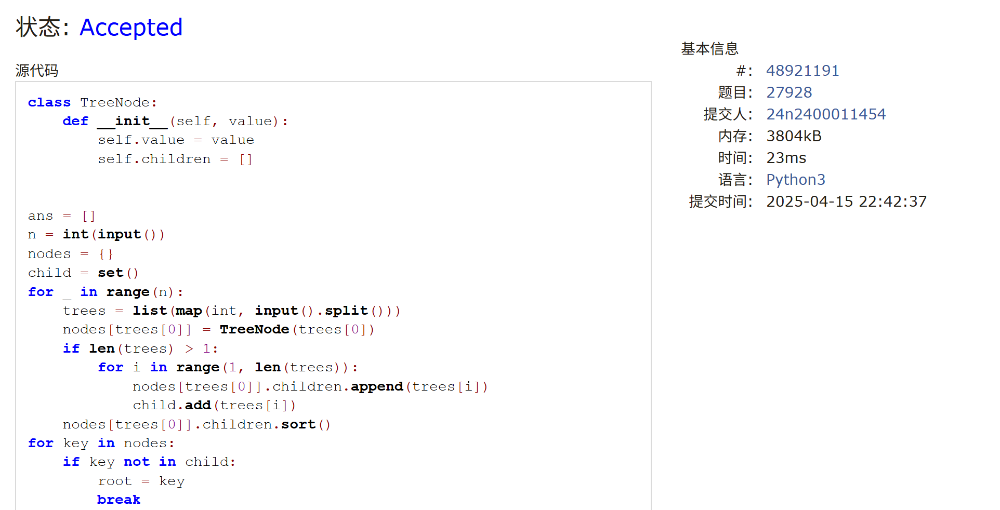
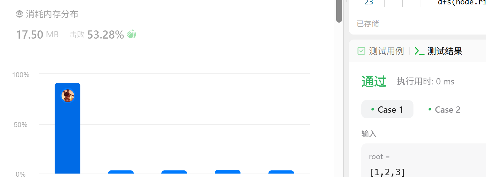
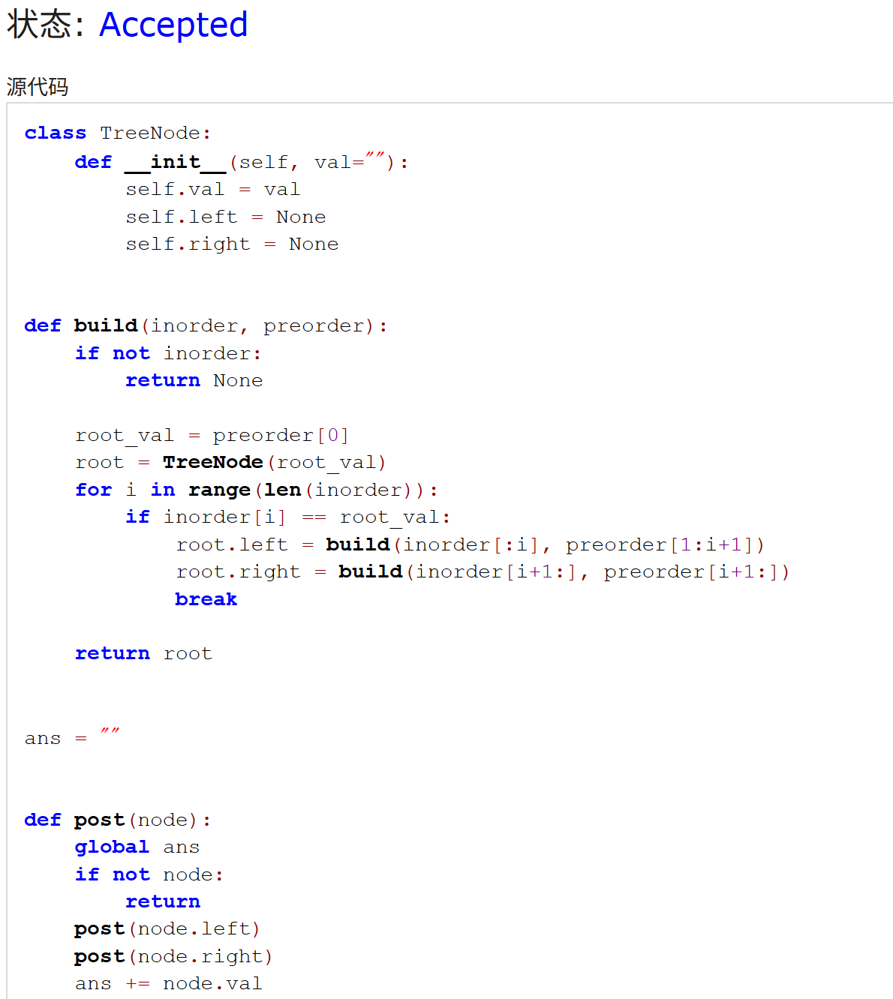
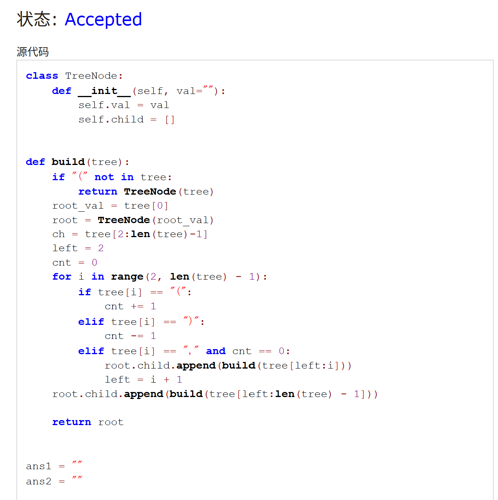

# Assignment #8: 树为主

Updated 1704 GMT+8 Apr 8, 2025

2025 spring, Complied by <mark>金俊毅、物理学院</mark>


> **说明：**
>
> 1. **解题与记录：**
>
>    对于每一个题目，请提供其解题思路（可选），并附上使用Python或C++编写的源代码（确保已在OpenJudge， Codeforces，LeetCode等平台上获得Accepted）。请将这些信息连同显示“Accepted”的截图一起填写到下方的作业模板中。（推荐使用Typora https://typoraio.cn 进行编辑，当然你也可以选择Word。）无论题目是否已通过，请标明每个题目大致花费的时间。
>
> 2. **提交安排：**提交时，请首先上传PDF格式的文件，并将.md或.doc格式的文件作为附件上传至右侧的“作业评论”区。确保你的Canvas账户有一个清晰可见的头像，提交的文件为PDF格式，并且“作业评论”区包含上传的.md或.doc附件。
>
> 3. **延迟提交：**如果你预计无法在截止日期前提交作业，请提前告知具体原因。这有助于我们了解情况并可能为你提供适当的延期或其他帮助。 
>
> 请按照上述指导认真准备和提交作业，以保证顺利完成课程要求。


## 1. 题目

### LC108.将有序数组转换为二叉树

dfs, https://leetcode.cn/problems/convert-sorted-array-to-binary-search-tree/

代码：

```python
class Solution:
    def sortedArrayToBST(self, nums):
        if not nums:
            return
        mid = len(nums) // 2
        root = TreeNode(nums[mid])
        root.left = self.sortedArrayToBST(nums[:mid])
        root.right = self.sortedArrayToBST(nums[mid +1:])
        
        return root
```


代码运行截图 <mark>（至少包含有"Accepted"）</mark>


### M27928:遍历树

 adjacency list, dfs, http://cs101.openjudge.cn/practice/27928/

代码：

```python
class TreeNode:
    def __init__(self, value):
        self.value = value
        self.children = []


ans = []
n = int(input())
nodes = {}
child = set()
for _ in range(n):
    trees = list(map(int, input().split()))
    nodes[trees[0]] = TreeNode(trees[0])
    if len(trees) > 1:
        for i in range(1, len(trees)):
            nodes[trees[0]].children.append(trees[i])
            child.add(trees[i])
    nodes[trees[0]].children.sort()
for key in nodes:
    if key not in child:
        root = key
        break


def curve(node):
    if not node.children:
        print(node.value)
        return

    arbit = 0
    for v in node.children:
        if v > node.value and arbit == 0:
            arbit = 1
            print(node.value)
        curve(nodes[v])
    if arbit == 0:
        print(node.value)

curve(nodes[root])
```


代码运行截图 <mark>（至少包含有"Accepted"）</mark>



### LC129.求根节点到叶节点数字之和

dfs, https://leetcode.cn/problems/sum-root-to-leaf-numbers/

代码：

```python
# Definition for a binary tree node.
# class TreeNode:
#     def __init__(self, val=0, left=None, right=None):
#         self.val = val
#         self.left = left
#         self.right = right
class Solution:
    def sumNumbers(self, root: Optional[TreeNode]) -> int:
        """
        :type root: Optional[TreeNode]
        :rtype: int
        """
        ans = 0
        def dfs(node, s):
            nonlocal ans
            if node == None:
                return
            if node.left == None and node.right == None:
                ans += 10*s + node.val
                return
            
            dfs(node.left, 10*s+node.val)
            dfs(node.right, 10*s+node.val)
        dfs(root, 0)
        return ans
```


代码运行截图 <mark>（至少包含有"Accepted"）</mark>



### M22158:根据二叉树前中序序列建树

tree, http://cs101.openjudge.cn/practice/22158/

代码：

```python
class TreeNode:
    def __init__(self, val=""):
        self.val = val
        self.left = None
        self.right = None


def build(inorder, preorder):
    if not inorder:
        return None

    root_val = preorder[0]
    root = TreeNode(root_val)
    for i in range(len(inorder)):
        if inorder[i] == root_val:
            root.left = build(inorder[:i], preorder[1:i+1])
            root.right = build(inorder[i+1:], preorder[i+1:])
            break

    return root


ans = ""


def post(node):
    global ans
    if not node:
        return
    post(node.left)
    post(node.right)
    ans += node.val


while True:
    try:
        m = input()
        p = input()
    except EOFError:
        break
    ans = ""
    post(build(p, m))
    print(ans)
```


代码运行截图 <mark>（至少包含有"Accepted"）</mark>



### M24729:括号嵌套树

dfs, stack, http://cs101.openjudge.cn/practice/24729/

代码：

```python
class TreeNode:
    def __init__(self, val=""):
        self.val = val
        self.child = []


def build(tree):
    if "(" not in tree:
        return TreeNode(tree)
    root_val = tree[0]
    root = TreeNode(root_val)
    ch = tree[2:len(tree)-1]
    left = 2
    cnt = 0
    for i in range(2, len(tree) - 1):
        if tree[i] == "(":
            cnt += 1
        elif tree[i] == ")":
            cnt -= 1
        elif tree[i] == "," and cnt == 0:
            root.child.append(build(tree[left:i]))
            left = i + 1
    root.child.append(build(tree[left:len(tree) - 1]))

    return root


ans1 = ""
ans2 = ""


def preorder(node):
    global ans1

    if not node:
        return

    ans1 += node.val
    for ch in node.child:
        preorder(ch)


def postorder(node):
    global ans2

    if not node:
        return

    for ch in node.child:
        postorder(ch)
    ans2 += node.val


btr = input()
preorder(build(btr))
postorder(build(btr))
print(ans1)
print(ans2)
```


代码运行截图 <mark>（至少包含有"Accepted"）</mark>



### LC3510.移除最小数对使数组有序II

doubly-linked list + heap, https://leetcode.cn/problems/minimum-pair-removal-to-sort-array-ii/

思路：


代码：

```python

```


代码运行截图 <mark>（至少包含有"Accepted"）</mark>


## 2. 学习总结和收获

这周作业给期中考试忙忘了，还差一道题看着是困难难度没时间写了，过两天再仔细看一下。1到5题都比较容易，可能一直是在啃寒假学的老本，希望在下一周开始之后有计划的再写一些每日选做。


