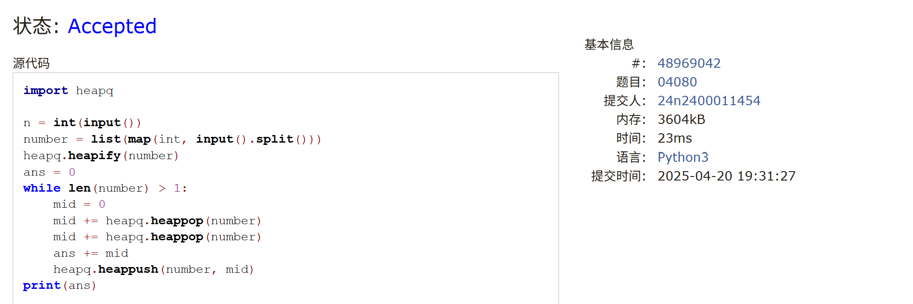
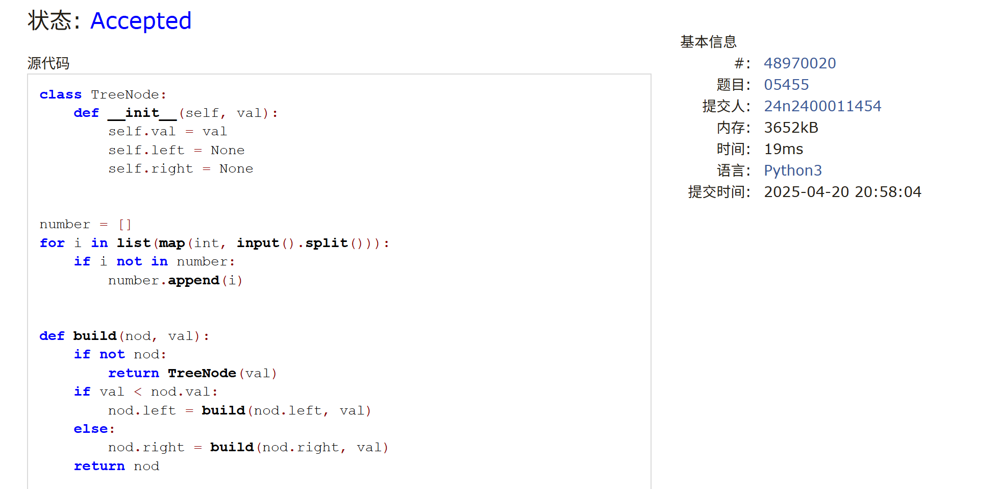
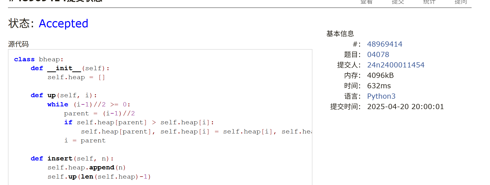
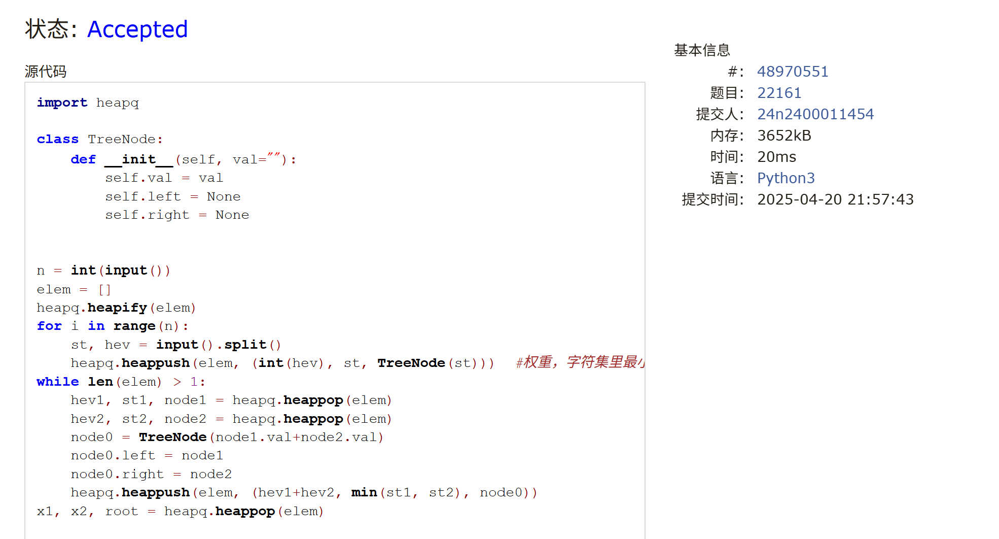

# Assignment #9: Huffman, BST & Heap

Updated 1834 GMT+8 Apr 15, 2025

2025 spring, Complied by <mark>金俊毅、物理学院</mark>


> **说明：**
>
> 1. **解题与记录：**
>
>    对于每一个题目，请提供其解题思路（可选），并附上使用Python或C++编写的源代码（确保已在OpenJudge， Codeforces，LeetCode等平台上获得Accepted）。请将这些信息连同显示“Accepted”的截图一起填写到下方的作业模板中。（推荐使用Typora https://typoraio.cn 进行编辑，当然你也可以选择Word。）无论题目是否已通过，请标明每个题目大致花费的时间。
>
> 2. **提交安排：**提交时，请首先上传PDF格式的文件，并将.md或.doc格式的文件作为附件上传至右侧的“作业评论”区。确保你的Canvas账户有一个清晰可见的头像，提交的文件为PDF格式，并且“作业评论”区包含上传的.md或.doc附件。
>
> 3. **延迟提交：**如果你预计无法在截止日期前提交作业，请提前告知具体原因。这有助于我们了解情况并可能为你提供适当的延期或其他帮助。 
>
> 请按照上述指导认真准备和提交作业，以保证顺利完成课程要求。


## 1. 题目

### LC222.完全二叉树的节点个数

dfs, https://leetcode.cn/problems/count-complete-tree-nodes/

代码：

```python
class Solution:
    def countNodes(self, root: Optional[TreeNode]) -> int:
        cnt = 0
        
        def dfs(node):
            nonlocal cnt
            if not node:
                return
            cnt += 1
            dfs(node.left)
            dfs(node.right)
        dfs(root)
        return cnt
```


代码运行截图 <mark>（至少包含有"Accepted"）</mark>


### LC103.二叉树的锯齿形层序遍历

bfs, https://leetcode.cn/problems/binary-tree-zigzag-level-order-traversal/
代码：

```python
class Solution:
    def zigzagLevelOrder(self, root: Optional[TreeNode]) -> List[List[int]]:
        if not root:
            return []
        nodes = [[root]]
        ans = [[root.val]]
        arbit = 1
        while nodes[-1]:
            ans.append([])
            nodes.append([])
            for i in range(len(nodes[-2])-1, -1, -1):
                if arbit == 1:
                    if nodes[-2][i].right:
                        nodes[-1].append(nodes[-2][i].right)
                        ans[-1].append(nodes[-2][i].right.val)
                    if nodes[-2][i].left:
                        nodes[-1].append(nodes[-2][i].left)
                        ans[-1].append(nodes[-2][i].left.val)
                else:
                    if nodes[-2][i].left:
                        nodes[-1].append(nodes[-2][i].left)
                        ans[-1].append(nodes[-2][i].left.val)
                    if nodes[-2][i].right:
                        nodes[-1].append(nodes[-2][i].right)
                        ans[-1].append(nodes[-2][i].right.val)
            arbit = (arbit + 1) % 2
        ans.pop()
        return ans
```


代码运行截图 <mark>（至少包含有"Accepted"）</mark>


### M04080:Huffman编码树

greedy, http://cs101.openjudge.cn/practice/04080/

代码：

```python
import heapq

n = int(input())
number = list(map(int, input().split()))
heapq.heapify(number)
ans = 0
while len(number) > 1:
    mid = 0
    mid += heapq.heappop(number)
    mid += heapq.heappop(number)
    ans += mid
    heapq.heappush(number, mid)
print(ans)
```


代码运行截图 <mark>（至少包含有"Accepted"）</mark>



### M05455: 二叉搜索树的层次遍历

http://cs101.openjudge.cn/practice/05455/


代码：

```python
class TreeNode:
    def __init__(self, val):
        self.val = val
        self.left = None
        self.right = None


number = []
for i in list(map(int, input().split())):
    if i not in number:
        number.append(i)


def build(nod, val):
    if not nod:
        return TreeNode(val)
    if val < nod.val:
        nod.left = build(nod.left, val)
    else:
        nod.right = build(nod.right, val)
    return nod


root = None
for num in number:
    root = build(root, num)
ans = [str(root.val)]
cell = [[root]]
while True:
    cell.append([])
    for node in cell[-2]:
        if node.left:
            cell[-1].append(node.left)
            ans.append(str(node.left.val))
        if node.right:
            cell[-1].append(node.right)
            ans.append(str(node.right.val))
    if not cell[-1]:
        break
print(" ".join(ans))
```


代码运行截图 <mark>（至少包含有"Accepted"）</mark>



### M04078: 实现堆结构

手搓实现，http://cs101.openjudge.cn/practice/04078/

类似的题目是 晴问9.7: 向下调整构建大顶堆，https://sunnywhy.com/sfbj/9/7

代码：

```python
class bheap:
    def __init__(self):
        self.heap = []

    def up(self, i):
        while (i-1)//2 >= 0:
            parent = (i-1)//2
            if self.heap[parent] > self.heap[i]:
                self.heap[parent], self.heap[i] = self.heap[i], self.heap[parent]
            i = parent

    def insert(self, n):
        self.heap.append(n)
        self.up(len(self.heap)-1)

    def down(self, i):
        while 2*i+1 < len(self.heap):
            las = self.last(i)
            if self.heap[las] < self.heap[i]:
                self.heap[las], self.heap[i] = self.heap[i], self.heap[las]
            i = las

    def last(self, i):
        if 2*i+2 >= len(self.heap):
            return 2*i+1
        if self.heap[2*i+1] < self.heap[2*i+2]:
            return 2*i+1
        return 2*i+2

    def heapify(self, lis):
        mid = len(lis) // 2 - 1
        for i in range(mid, -1, -1):
            self.down(i)

    def delete(self):
        self.heap[0], self.heap[-1] = self.heap[-1], self.heap[0]
        re = self.heap.pop()
        self.down(0)
        return re


n = int(input())
bh = bheap()
for _ in range(n):
    operate = input().split()
    if operate[0] == "2":
        print(bh.delete())
    else:
        bh.insert(int(operate[1]))
```


代码运行截图 <mark>（至少包含有"Accepted"）</mark>



### T22161: 哈夫曼编码树

greedy, http://cs101.openjudge.cn/practice/22161/

代码：

```python
import heapq

class TreeNode:
    def __init__(self, val=""):
        self.val = val
        self.left = None
        self.right = None


n = int(input())
elem = []
heapq.heapify(elem)
for i in range(n):
    st, hev = input().split()
    heapq.heappush(elem, (int(hev), st, TreeNode(st)))  #权重，字符集里最小字符，字符本身
while len(elem) > 1:
    hev1, st1, node1 = heapq.heappop(elem)
    hev2, st2, node2 = heapq.heappop(elem)
    node0 = TreeNode(node1.val+node2.val)
    node0.left = node1
    node0.right = node2
    heapq.heappush(elem, (hev1+hev2, min(st1, st2), node0))
x1, x2, root = heapq.heappop(elem)

codes = {}


def tran(node, mid_st):
    if node.left is None and node.right is None:
        codes[node.val] = mid_st
        return

    if node.left:
        tran(node.left, mid_st+"0")
    if node.right:
        tran(node.right, mid_st+"1")


tran(root, "")


def encode(string):
    now = ""
    ans = ""
    for s in string:
        now += s
        if now in codes:
            ans += codes[now]
            now = ""
    return ans


def decode(code):
    node = root
    ans = ""
    for c in code:
        if c == "0":
            node = node.left
        else:
            node = node.right
        if node.left is None and node.right is None:
            ans += node.val
            node = root
    return ans


while True:
    try:
        unknown = input()
    except EOFError:
        break

    if 48 <= ord(unknown[0]) <= 57:
        print(decode(unknown))
    else:
        print(encode(unknown))
```


代码运行截图 <mark>（至少包含有"Accepted"）</mark>



## 2. 学习总结和收获
做第四题的时候把题目建树的方式理解错了，然后一直没想明白到底错在了哪里，提醒之后审题要仔细一点，尤其是考试（
学习了哈夫曼编码树，然后回想起了剪绳子那道题


