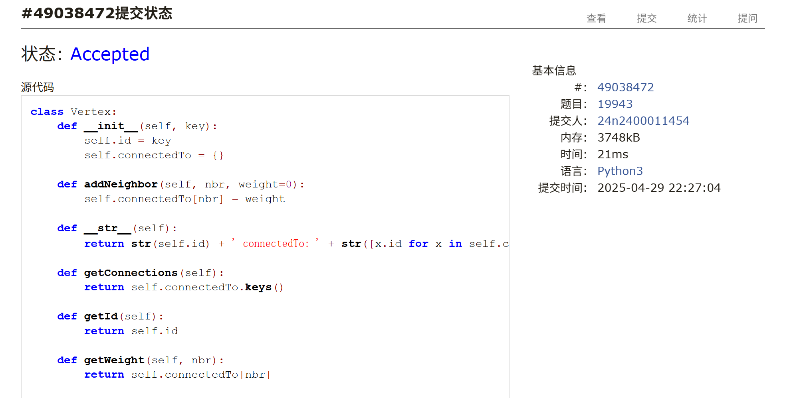
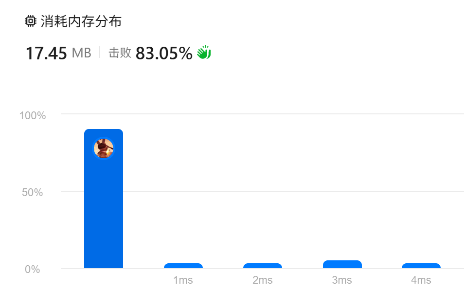
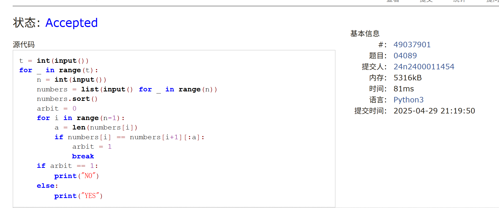
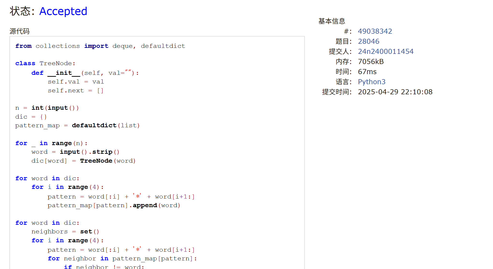

# Assignment #A: Graph starts

Updated 1830 GMT+8 Apr 22, 2025

2025 spring, Complied by <mark>金俊毅、物理学院</mark>


> **说明：**
>
> 1. **解题与记录：**
>
>    对于每一个题目，请提供其解题思路（可选），并附上使用Python或C++编写的源代码（确保已在OpenJudge， Codeforces，LeetCode等平台上获得Accepted）。请将这些信息连同显示“Accepted”的截图一起填写到下方的作业模板中。（推荐使用Typora https://typoraio.cn 进行编辑，当然你也可以选择Word。）无论题目是否已通过，请标明每个题目大致花费的时间。
>
> 2. **提交安排：**提交时，请首先上传PDF格式的文件，并将.md或.doc格式的文件作为附件上传至右侧的“作业评论”区。确保你的Canvas账户有一个清晰可见的头像，提交的文件为PDF格式，并且“作业评论”区包含上传的.md或.doc附件。
>
> 3. **延迟提交：**如果你预计无法在截止日期前提交作业，请提前告知具体原因。这有助于我们了解情况并可能为你提供适当的延期或其他帮助。 
>
> 请按照上述指导认真准备和提交作业，以保证顺利完成课程要求。


## 1. 题目

### M19943:图的拉普拉斯矩阵

OOP, implementation, http://cs101.openjudge.cn/practice/19943/

要求创建Graph, Vertex两个类，建图实现。

代码：

```python
class Vertex:
    def __init__(self, key):
        self.id = key
        self.connectedTo = {}

    def addNeighbor(self, nbr, weight=0):
        self.connectedTo[nbr] = weight

    def __str__(self):
        return str(self.id) + ' connectedTo: ' + str([x.id for x in self.connectedTo])

    def getConnections(self):
        return self.connectedTo.keys()

    def getId(self):
        return self.id

    def getWeight(self, nbr):
        return self.connectedTo[nbr]


class Graph:
    def __init__(self):
        self.vertList = {}
        self.numVertices = 0

    def addVertex(self, key):
        self.numVertices = self.numVertices + 1
        newVertex = Vertex(key)
        self.vertList[key] = newVertex
        return newVertex

    def getVertex(self, n):
        if n in self.vertList:
            return self.vertList[n]
        else:
            return None

    def __contains__(self, n):
        return n in self.vertList

    def addEdge(self, f, t, weight=0):
        if f not in self.vertList:
            nv = self.addVertex(f)
        if t not in self.vertList:
            nv = self.addVertex(t)
        self.vertList[f].addNeighbor(self.vertList[t], weight)

    def getVertices(self):
        return self.vertList.keys()

    def __iter__(self):
        return iter(self.vertList.values())


def constructLaplacianMatrix(n, edges):
    graph = Graph()
    for i in range(n):
        graph.addVertex(i)

    for edge in edges:
        a, b = edge
        graph.addEdge(a, b)
        graph.addEdge(b, a)

    laplacianMatrix = []
    for vertex in graph:
        row = [0] * n
        row[vertex.getId()] = len(vertex.getConnections())
        for neighbor in vertex.getConnections():
            row[neighbor.getId()] = -1
        laplacianMatrix.append(row)

    return laplacianMatrix


n, m = map(int, input().split())
edges = []
for i in range(m):
    a, b = map(int, input().split())
    edges.append((a, b))

laplacianMatrix = constructLaplacianMatrix(n, edges)

for row in laplacianMatrix:
    print(' '.join(map(str, row)))
```


代码运行截图 <mark>（至少包含有"Accepted"）</mark>



### LC78.子集

backtracking, https://leetcode.cn/problems/subsets/

代码：

```python
class Solution:
    def subsets(self, nums: List[int]) -> List[List[int]]:
        ans = [[]]
        def nex(step, hist):
            if step == len(nums):
                return
            
            ans.append(hist+[nums[step]])
            nex(step+1, hist)
            nex(step+1, hist+[nums[step]])
        
        nex(0, [])
        return ans
```


代码运行截图 <mark>（至少包含有"Accepted"）</mark>


### LC17.电话号码的字母组合

hash table, backtracking, https://leetcode.cn/problems/letter-combinations-of-a-phone-number/


代码：

```python
class Solution:
    def letterCombinations(self, digits: str) -> List[str]:
        dic = {"2": ["a", "b", "c"], "3": ["d", "e", "f"], "4": ["g", "h", "i"], "5": ["j", "k", "l"], "6": ["m", "n", "o"], "7": ["p", "q", "r", "s"], "8": ["t", "u", "v"], "9": ["w", "x", "y", "z"]}
        ans = []
        if not digits:
            return []

        def arr(step, s):
            nonlocal digits
            if int(step) == len(digits):
                ans.append(s)
                return

            a = dic[digits[step]]
            for t in a:
                arr(step+1, s+t)
        
        arr(0, "")
        return ans
```


代码运行截图 <mark>（至少包含有"Accepted"）</mark>



### M04089:电话号码

trie, http://cs101.openjudge.cn/practice/04089/


代码：

```python
t = int(input())
for _ in range(t):
    n = int(input())
    numbers = list(input() for _ in range(n))
    numbers.sort()
    arbit = 0
    for i in range(n-1):
        a = len(numbers[i])
        if numbers[i] == numbers[i+1][:a]:
            arbit = 1
            break
    if arbit == 1:
        print("NO")
    else:
        print("YES")
```


代码运行截图 <mark>（至少包含有"Accepted"）</mark>



### T28046:词梯

bfs, http://cs101.openjudge.cn/practice/28046/

代码：

```python
from collections import deque, defaultdict

class TreeNode:
    def __init__(self, val=""):
        self.val = val
        self.next = []

n = int(input())
dic = {}
pattern_map = defaultdict(list)

for _ in range(n):
    word = input().strip()
    dic[word] = TreeNode(word)

for word in dic:
    for i in range(4):
        pattern = word[:i] + '*' + word[i+1:]
        pattern_map[pattern].append(word)

for word in dic:
    neighbors = set()
    for i in range(4):
        pattern = word[:i] + '*' + word[i+1:]
        for neighbor in pattern_map[pattern]:
            if neighbor != word:
                neighbors.add(neighbor)
    dic[word].next = list(neighbors)

start, end = input().split()

if start not in dic or end not in dic:
    print("NO")
    exit()

visited = set()
now = deque()
now.append((start, [start]))
visited.add(start)
arbit = 0
while now:
    mid, hist = now.popleft()
    for down in dic[mid].next:
        if down not in visited:
            now.append((down, hist+[down]))
            if down == end:
                print(" ".join(hist+[down]))
                arbit = 1
                break
            visited.add(down)
    if arbit == 1:
        break
if arbit == 0:
    print("NO")
```


代码运行截图 <mark>（至少包含有"Accepted"）</mark>



### T51.N皇后

backtracking, https://leetcode.cn/problems/n-queens/


代码：

```python
class Solution:
    def solveNQueens(self, n: int) -> List[List[str]]:
        ANS = []
        def answer(lis):
            ans = []
            for i in lis:
                mid = ["." for _ in range(i)] + ["Q"] + ["." for _ in range(len(lis)-1-i)]
                ans.append("".join(mid))
            return ans


        def queen(step, hist):
            nonlocal n
            if step == n:
                ANS.append(answer(hist))
                return

            for i in range(n):
                arbit = 0
                for j in range(step):
                    if hist[j] == i or abs(step-j) == abs(i-hist[j]):
                        arbit = 1
                        break
                if arbit == 0:
                    queen(step+1, hist+[i])

        queen(0, [])
        return ANS
```


代码运行截图 <mark>（至少包含有"Accepted"）</mark>


## 2. 学习总结和收获

这周作业主要是学到第五题建图的方式，做了一些每日选做


