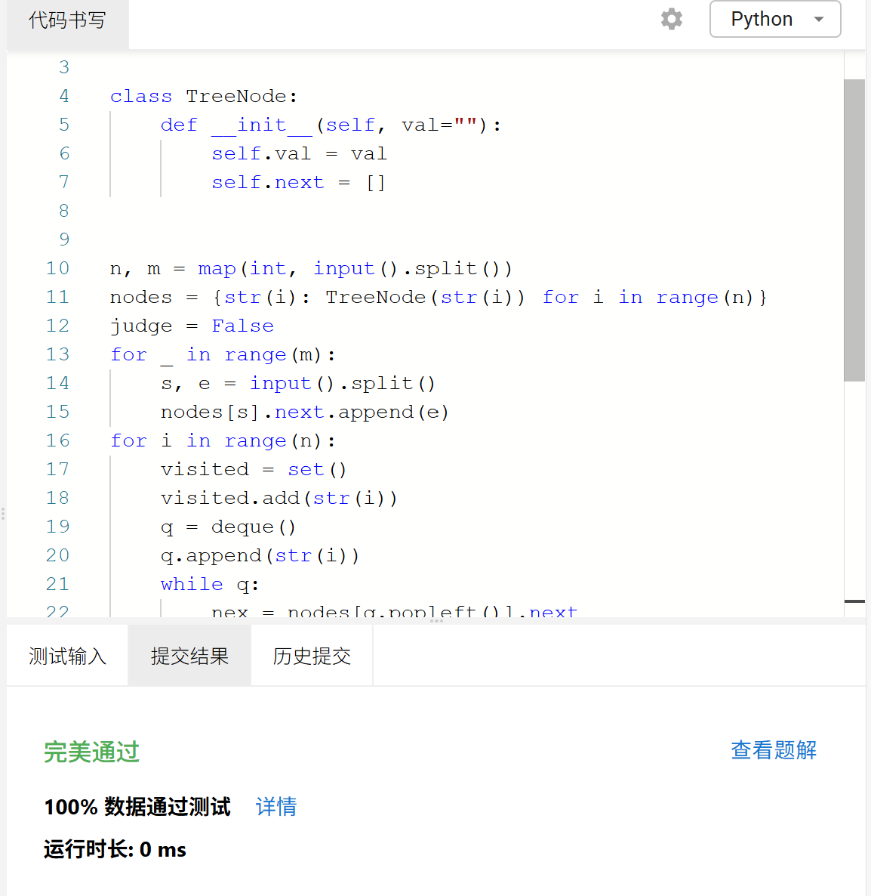

# Assignment #B: 图为主

Updated 2223 GMT+8 Apr 29, 2025

2025 spring, Complied by <mark>金俊毅、物理学院</mark>


> **说明：**
>
> 1. **解题与记录：**
>
>    对于每一个题目，请提供其解题思路（可选），并附上使用Python或C++编写的源代码（确保已在OpenJudge， Codeforces，LeetCode等平台上获得Accepted）。请将这些信息连同显示“Accepted”的截图一起填写到下方的作业模板中。（推荐使用Typora https://typoraio.cn 进行编辑，当然你也可以选择Word。）无论题目是否已通过，请标明每个题目大致花费的时间。
>
> 2. **提交安排：**提交时，请首先上传PDF格式的文件，并将.md或.doc格式的文件作为附件上传至右侧的“作业评论”区。确保你的Canvas账户有一个清晰可见的头像，提交的文件为PDF格式，并且“作业评论”区包含上传的.md或.doc附件。
>
> 3. **延迟提交：**如果你预计无法在截止日期前提交作业，请提前告知具体原因。这有助于我们了解情况并可能为你提供适当的延期或其他帮助。 
>
> 请按照上述指导认真准备和提交作业，以保证顺利完成课程要求。


## 1. 题目

### E07218:献给阿尔吉侬的花束

bfs, http://cs101.openjudge.cn/practice/07218/

代码：

```python
from collections import deque

dire = [(1, 0), (-1, 0), (0, -1), (0, 1)]
t = int(input())
for _ in range(t):
    n, m = map(int, input().split())
    Map = [input() for _ in range(n)]
    sym = [[True for _ in range(m)] for _ in range(n)]
    q = deque()
    arbit = False
    cnt = 0
    for i in range(n):
        for j in range(m):
            if Map[i][j] == "S":
                q.append((i, j, 0))
                sym[i][j] = False
            elif Map[i][j] == "#":
                sym[i][j] = False
    while q:
        x, y, step = q.popleft()
        for i in range(4):
            dx, dy = dire[i]
            if 0 <= x+dx < n and 0 <= y+dy < m:
                if Map[x+dx][y+dy] == "E":
                    arbit = True
                    cnt = step+1
                    break
                if sym[x+dx][y+dy]:
                    sym[x+dx][y+dy] = False
                    q.append((x+dx, y+dy, step+1))
        if arbit:
            break
    if arbit:
        print(str(cnt))
    else:
        print("oop!")
```


代码运行截图 <mark>（至少包含有"Accepted"）</mark>


### M3532.针对图的路径存在性查询I

disjoint set, https://leetcode.cn/problems/path-existence-queries-in-a-graph-i/

代码：

```python
class Solution:
    def pathExistenceQueries(self, n: int, nums: List[int], maxDiff: int, queries: List[List[int]]) -> List[bool]:
        cnt = 0
        ans = []
        dic = {}
        for i in range(n-1):
            dic[i] = cnt
            if nums[i+1] - nums[i] > maxDiff:
                cnt += 1
        dic[n-1] = cnt
        for q in queries:
            if dic[q[0]] == dic[q[1]]:
                ans.append(True)
            else:
                ans.append(False)
        return ans
```


代码运行截图 <mark>（至少包含有"Accepted"）</mark>


### M22528:厚道的调分方法

binary search, http://cs101.openjudge.cn/practice/22528/

代码：

```python
mark = sorted(list(map(float, input().split())))
n = len(mark)
rest = int(0.4*n)
x = mark[rest]
left = 0
right = 1000000000
while right - left > 1:
    mid = (left+right)//2
    sc = mid*x/1000000000 + 1.1**(mid*x/1000000000)
    if sc > 85:
        right = mid
    else:
        left = mid
print(right)
```


代码运行截图 <mark>（至少包含有"Accepted"）</mark>


### Msy382: 有向图判环 

dfs, https://sunnywhy.com/sfbj/10/3/382
代码：

```python
from collections import deque


class TreeNode:
    def __init__(self, val=""):
        self.val = val
        self.next = []


n, m = map(int, input().split())
nodes = {str(i): TreeNode(str(i)) for i in range(n)}
judge = False
for _ in range(m):
    s, e = input().split()
    nodes[s].next.append(e)
for i in range(n):
    visited = set()
    visited.add(str(i))
    q = deque()
    q.append(str(i))
    while q:
        nex = nodes[q.popleft()].next
        for j in nex:
            if j == str(i):
                judge = True
                break
            if j not in visited:
                visited.add(j)
                q.append(j)
        if judge:
            break
    if judge:
        break
if judge:
    print("Yes")
else:
    print("No")
```


代码运行截图 <mark>（至少包含有"Accepted"）</mark>



### M05443:兔子与樱花

Dijkstra, http://cs101.openjudge.cn/practice/05443/

代码：

```python
import heapq


class TreeNode:
    def __init__(self, val=""):
        self.val = val
        self.next = []


p = int(input())
place = {}
for _ in range(p):
    pl = input()
    place[pl] = TreeNode(pl)
q = int(input())
for _ in range(q):
    pl1, pl2, dist = map(str, input().split())
    place[pl1].next.append((pl2, int(dist)))
    place[pl2].next.append((pl1, int(dist)))
r = int(input())
for _ in range(r):
    start, end = map(str, input().split())
    value = {}
    matter = {}
    for key in place:
        value[key] = float("inf")
        matter[key] = ""
    value[start] = 0
    matter[start] = start
    q = [(0, start)]
    heapq.heapify(q)
    while q:
        d, pl = heapq.heappop(q)
        if pl == end:
            print(matter[pl])
            break
        for nex in place[pl].next:
            np, nd = nex
            if d+nd < value[np]:
                value[np] = d+nd
                matter[np] = matter[pl]+"->("+str(nd)+")->"+np
                heapq.heappush(q, (d+nd, np))
```


代码运行截图 <mark>（至少包含有"Accepted"）</mark>


### T28050: 骑士周游

dfs, http://cs101.openjudge.cn/practice/28050/

代码：

```python
n = int(input())
sr, sc = map(int, input().split())
chess = [[True for _ in range(n)] for _ in range(n)]
dire = [(1, 2), (1, -2), (-1, 2), (-1, -2), (2, -1), (2, 1), (-2, 1), (-2, -1)]
chess[sr][sc] = False


def cnt(a, b):
    ans = 0
    for i in range(8):
        dx, dy = dire[i]
        if 0 <= a+dx < n and 0 <= b+dy < n:
            if chess[a+dx][b+dy]:
                ans += 1
    return ans


def dfs(x, y, step):
    global n

    if step == n**2 - 1:
        return True
    nex = []
    for i in range(8):
        dx, dy = dire[i]
        if 0 <= x+dx < n and 0 <= y+dy < n:
            if chess[x+dx][y+dy]:
                nex.append((cnt(x+dx, y+dy), x+dx, y+dy))
    nex.sort()
    for p in nex:
        aaa, nx, ny = p
        chess[nx][ny] = False
        if dfs(nx, ny, step+1):
            return True
        chess[nx][ny] = True

    return False


if dfs(sr, sc, 0):
    print("success")
else:
    print("fail")
```


代码运行截图 <mark>（至少包含有"Accepted"）</mark>


## 2. 学习总结和收获

只有第六题的算法优化比较新鲜，其他题都比较容易。

五一期间继续做每日选做。


