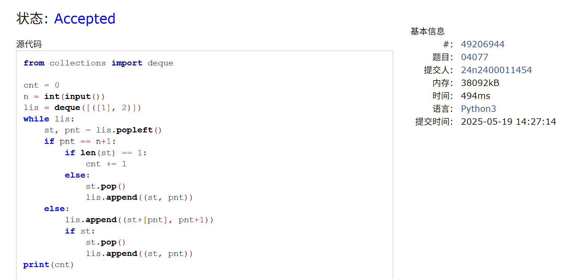

# Assignment #C: 202505114 Mock Exam

Updated 1518 GMT+8 May 14, 2025

2025 spring, Complied by <mark>金俊毅、物理学院</mark>


## 1. 题目

### E06364: 牛的选举

http://cs101.openjudge.cn/practice/06364/

代码：

```python
n, k = map(int, input().split())
note = []
for i in range(n):
    note.append(list(map(int, input().split()))+[i+1])
new = sorted(note, reverse=True)[:k]
las = [new[i][1:] for i in range(k)]
las.sort(reverse=True)
print(las[0][1])
```


代码运行截图 <mark>（至少包含有"Accepted"）</mark>


### M04077: 出栈序列统计

http://cs101.openjudge.cn/practice/04077/


代码：

```python
from collections import deque

cnt = 0
n = int(input())
lis = deque([([1], 2)])
while lis:
    st, pnt = lis.popleft()
    if pnt == n+1:
        if len(st) == 1:
            cnt += 1
        else:
            st.pop()
            lis.append((st, pnt))
    else:
        lis.append((st+[pnt], pnt+1))
        if st:
            st.pop()
            lis.append((st, pnt))
print(cnt)
```


代码运行截图 <mark>（至少包含有"Accepted"）</mark>



### M05343:用队列对扑克牌排序

http://cs101.openjudge.cn/practice/05343/


代码：

```python
n = int(input())
pokes = input().split()
dic1 = {str(i): [] for i in range(1, 10)}
for poke in pokes:
    dic1[poke[1]].append(poke)
queue1 = []
for i in range(1, 10):
    print("Queue"+str(i)+":"+" ".join(dic1[str(i)]))
    for p in dic1[str(i)]:
        queue1.append(p)
litter = ["A", "B", "C", "D"]
dic2 = {i: [] for i in litter}
queue2 = []
for poke in queue1:
    dic2[poke[0]].append(poke)
for i in litter:
    print("Queue" + i + ":" + " ".join(dic2[i]))
    for p in dic2[i]:
        queue2.append(p)
print(" ".join(queue2))
```


代码运行截图 <mark>（至少包含有"Accepted"）</mark>


### M04084: 拓扑排序

http://cs101.openjudge.cn/practice/04084/

代码：

```python
v, a = map(int, input().split())
dic1 = {i: 0 for i in range(1, v+1)}
dic2 = {i: [] for i in range(1, v+1)}
for _ in range(a):
    s, e = map(int, input().split())
    dic2[s].append(e)
    dic1[e] += 1
for key in dic2:
    dic2[key].sort()
ans = []
vis = set()
cnt = 0
while cnt < v:
    for i in range(1, v+1):
        if dic1[i] == 0 and i not in vis:
            ans.append("v"+str(i))
            vis.add(i)
            cnt += 1
            for node in dic2[i]:
                dic1[node] -= 1
            break
print(" ".join(ans))
```


代码运行截图 <mark>（至少包含有"Accepted"）</mark>


### M07735:道路

Dijkstra, http://cs101.openjudge.cn/practice/07735/

代码：

```python
import heapq

k = int(input())
n = int(input())
r = int(input())
roads = {i: [] for i in range(1, n+1)}
for _ in range(r):
    s, d, l, t = map(int, input().split())
    roads[s].append([d, l, t])
bob = [(0, 0, 1)]   #路长，钱, 位置
heapq.heapify(bob)
sym = {1: [[0, 0]]}
dst = float("inf")
judge = 0
while bob and judge == 0:
    dist, cost, pos = heapq.heappop(bob)
    for road in roads[pos]:
        nd, nc = dist+road[1], cost+road[2]
        if road[0] == n and nd < dst and nc <= k:
            dst = nd
            continue
        if dist >= dst:
            judge = 1
            break

        if road[0] not in sym:
            sym[road[0]] = [[nd, nc]]
            heapq.heappush(bob, (nd, nc, road[0]))
        else:
            arbit = 0
            for one in sym[road[0]]:
                if nd >= one[0] and nc >= one[1]:
                    arbit = 1
                    break
            if arbit == 0:
                sym[road[0]].append([nd, nc])
                heapq.heappush(bob, (nd, nc, road[0]))
if dst != float("inf"):
    print(dst)
else:
    print(-1)
```


代码运行截图 <mark>（至少包含有"Accepted"）</mark>


### T24637:宝藏二叉树

dp, http://cs101.openjudge.cn/practice/24637/

代码：

```python
class TreeNode:
    def __init__(self, val=0):
        self.val = val
        self.left = None
        self.right = None


n = int(input())
value = list(map(int, input().split()))
root = TreeNode(value[0])
tree = [[root]]
cnt = 1
floor = 1
while cnt < n:
    tree.append([])
    for i in range(0, 2**floor):
        if cnt < n:
            tree[-1].append(TreeNode(value[cnt]))
            cnt += 1
        else:
            tree[-1].append(None)
    floor += 1
for i in range(0, floor-1):
    k = 0
    for node0 in tree[i]:
        node0.left = tree[i+1][k]
        node0.right = tree[i+1][k+1]
        k += 2


def rec(node):
    if not node:
        return [(False, 0)]

    l = rec(node.left)
    r = rec(node.right)
    ans = [0, 0]
    for a in l:
        for b in r:
            if a[1] + b[1] > ans[0]:
                ans[0] = a[1] + b[1]
            if (not (a[0] or b[0])) and (a[1] + b[1] > ans[1]):
                ans[1] = a[1] + b[1]
    return [(False, ans[0]), (True, ans[1]+node.val)]


answer = rec(root)
print(max(answer[0][1], answer[1][1]))
```


代码运行截图 <mark>（至少包含有"Accepted"）</mark>


## 2. 学习总结和收获

自己找了个时间测了一下是AC5，拓扑排序这道题没有想到答案那样的思路没做出来。
这一周开始多练一下手，为机考做准备


