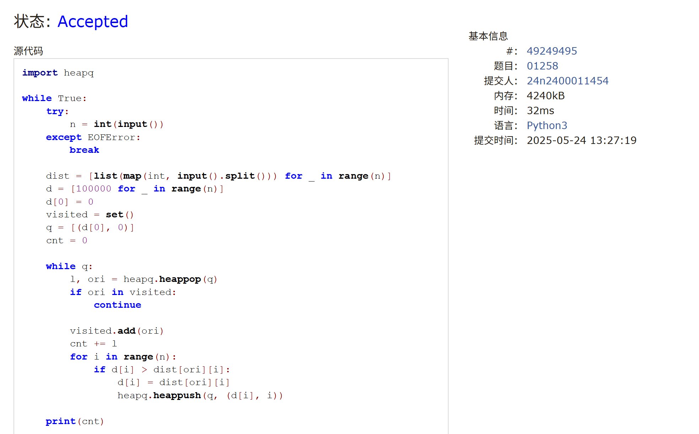

# Assignment #D: 图 & 散列表

Updated 2042 GMT+8 May 20, 2025

2025 spring, Complied by <mark>金俊毅、物理学院</mark>


## 1. 题目

### M17975: 用二次探查法建立散列表

http://cs101.openjudge.cn/practice/17975/

<mark>需要用这样接收数据。因为输入数据可能分行了，不是题面描述的形式。OJ上面有的题目是给C++设计的，细节考虑不周全。</mark>

```python
import sys
input = sys.stdin.read
data = input().split()
index = 0
n = int(data[index])
index += 1
m = int(data[index])
index += 1
num_list = [int(i) for i in data[index:index+n]]
```

代码：

```python
import sys
input = sys.stdin.read
data = input().split()
index = 0
n = int(data[index])
index += 1
m = int(data[index])
index += 1
num_list = [int(i) for i in data[index:index+n]]

mylist = [0.5] * m

def generate_result():
    for num in num_list:
        pos = num % m
        current = mylist[pos]
        if current == 0.5 or current == num:
            mylist[pos] = num
            yield pos
        else:
            sign = 1
            cnt = 1
            while True:
                now = pos + sign * (cnt ** 2)
                current = mylist[now % m]
                if current == 0.5 or current == num:
                    mylist[now % m] = num
                    yield now % m
                    break
                sign *= -1
                if sign == 1:
                    cnt += 1

result = generate_result()
print(*result)
```


代码运行截图 <mark>（至少包含有"Accepted"）</mark>


### M01258: Agri-Net

MST, http://cs101.openjudge.cn/practice/01258/

代码：

```python
import heapq

while True:
    try:
        n = int(input())
    except EOFError:
        break

    dist = [list(map(int, input().split())) for _ in range(n)]
    d = [100000 for _ in range(n)]
    d[0] = 0
    visited = set()
    q = [(d[0], 0)]
    cnt = 0

    while q:
        l, ori = heapq.heappop(q)
        if ori in visited:
            continue

        visited.add(ori)
        cnt += l
        for i in range(n):
            if d[i] > dist[ori][i]:
                d[i] = dist[ori][i]
                heapq.heappush(q, (d[i], i))

    print(cnt)
```


代码运行截图 <mark>（至少包含有"Accepted"）</mark>



### M3552.网络传送门旅游

bfs, https://leetcode.cn/problems/grid-teleportation-traversal/


代码：

```python
class Solution:
    def minMoves(self, matrix: List[str]) -> int:
        import heapq

        direction = [(0, 1), (0, -1), (1, 0), (-1, 0)]
        visited = set()
        visited.add((0, 0))
        m, n = len(matrix), len(matrix[0])
        q = [(0, 0, 0, "")]
        heapq.heapify(q)
        dic = {}

        for i in range(m):
            for j in range(n):
                if 65 <= ord(matrix[i][j]) <= 90:
                    if matrix[i][j] not in dic:
                        dic[matrix[i][j]] = [(i, j)]
                    else:
                        dic[matrix[i][j]].append((i, j))


        def bfs(y1, x1, ch1, step1):
            nonlocal ans
            nonlocal q
            nonlocal visited

            for i in range(4):
                dy, dx = direction[i]
                if 0 <= y1+dy <= m-1 and 0 <= x1+dx <= n-1:
                    if matrix[y1+dy][x1+dx] != "#" and (y1+dy, x1+dx) not in visited:
                        if x1+dx == n-1 and y1+dy == m-1:
                            ans = step1+1
                            break
                        if matrix[y1+dy][x1+dx] in dic and matrix[y1+dy][x1+dx] not in ch1:
                            for st1 in dic[matrix[y1+dy][x1+dx]]:
                                if st1 != (y1+dy, x1+dx):
                                    heapq.heappush(q, (step1+1, y1+dy, x1+dx, ch1+matrix[y1+dy][x1+dx]))
                                    visited.add(st1)
                        heapq.heappush(q, (step1+1, y1+dy, x1+dx, ch1))
                        visited.add((y1+dy, x1+dx))

        ans = -1
        while q and ans == -1:
            step, y, x, ch = heapq.heappop(q)
            if y == m-1 and x == n-1:
                ans = step
                break

            if matrix[y][x] in dic and matrix[y][x] not in ch:
                for st in dic[matrix[y][x]]:
                    if st == (m-1, n-1):
                        ans = step
                        break
                    if st != (y, x):
                        visited.add(st)
                        bfs(st[0], st[1], ch+matrix[y][x], step)
                if ans != -1:
                    break
            if ans != -1:
                break
            
            bfs(y, x, ch, step)
            
        
        return ans
```


代码运行截图 <mark>（至少包含有"Accepted"）</mark>


### M787.K站中转内最便宜的航班

Bellman Ford, https://leetcode.cn/problems/cheapest-flights-within-k-stops/

代码：

```python
class Solution:
    def findCheapestPrice(self, n: int, flights: List[List[int]], src: int, dst: int, k: int) -> int:
        dist = [float("inf")] * n
        dist[src] = 0
        for _ in range(k + 1):
            prev = dist[:]  
            for u, v, w in flights:
                if prev[u] + w < dist[v]:
                    dist[v] = prev[u] + w
        
        return dist[dst] if dist[dst] != float("inf") else -1
```


代码运行截图 <mark>（至少包含有"Accepted"）</mark>


### M03424: Candies

Dijkstra, http://cs101.openjudge.cn/practice/03424/

代码：

```python
import heapq

def dijkstra(N, G, start):
    INF = float('inf')
    dist = [INF] * (N + 1)
    dist[start] = 0
    pq = [(0, start)]
    while pq:
        d, node = heapq.heappop(pq)
        if d > dist[node]:
            continue
        for neighbor, weight in G[node]:
            new_dist = dist[node] + weight
            if new_dist < dist[neighbor]:
                dist[neighbor] = new_dist
                heapq.heappush(pq, (new_dist, neighbor))
    return dist


N, M = map(int, input().split())
G = [[] for _ in range(N + 1)]
for _ in range(M):
    s, e, w = map(int, input().split())
    G[s].append((e, w))


start_node = 1
shortest_distances = dijkstra(N, G, start_node)
print(shortest_distances[-1])
```


代码运行截图 <mark>（至少包含有"Accepted"）</mark>


### M22508:最小奖金方案

topological order, http://cs101.openjudge.cn/practice/22508/


代码：

```python
n, m = map(int, input().split())
dic1 = {i: 0 for i in range(n)}
dic2 = {i: [] for i in range(n)}
for _ in range(m):
    a, b = map(int, input().split())
    dic2[b].append(a)
    dic1[a] += 1

value = []
visited = set()
cnt = 0
ans = 100*n
while cnt < n:
    ceil = []
    for i in range(n):
        if dic1[i] == 0 and i not in visited:
            ceil.append(i)
            visited.add(i)
    value.append(len(ceil))
    for i in ceil:
        for j in dic2[i]:
            dic1[j] -= 1
    cnt += value[-1]
for i in range(len(value)):
    ans += i*value[i]
print(ans)
```


代码运行截图 <mark>（至少包含有"Accepted"）</mark>


## 2. 学习总结和收获

迅速推进每日选做中


