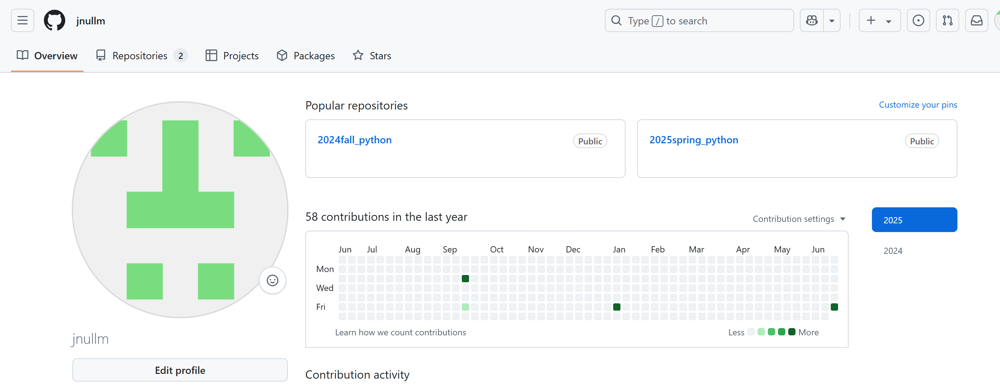

# Assignment #P: 课程大作业

Updated 1141 GMT+8 May 27, 2025

2025 spring, Complied by 金俊毅、物理学院

**说明：**

关乎每位同学维护自己的 GitHub 作业，本意是让大家练习常用于计算机科学学生的代码和文档维护方法。通过计算概论、数据结构和算法等课程，我们希望引导大家进入计算机学科领域。这将帮助同学们熟悉实际的编码和文档管理流程，并培养在团队协作和版本控制方面的技能。

1）提交内容，请填写到下面作业模版中。

2）<mark>截止时间是期末出分前4天</mark>，因为Canvas可以多次提交，建议期末机考前提交一次，考试后加上课程总结再提交一次。

评分标准

| 标准           | 等级                                   | 得分       |
| -------------- | -------------------------------------- | ---------- |
| 按时提交       | 1 得分提交，0.5 得分请假，0 得分未提交 | 1 分       |
| 你的GitHub网址 | 1 得分有，0 得分无                     | 1 分       |
| 你的GitHub截图 | 1 得分有，0 得分无                     | 1 分       |
| Cheatsheet     | 1 得分有，0 得分无                     | 1 分       |
| 课程资料和情报 | 1 得分有，0 得分无                     | 1 分       |
| 总得分：       |                                        | 5 ，满分 5 |

## 2. 提交内容

github网址：https://github.com/jnullm

本课程作业及cheetsheet已经放在了"2025spring_python"中

## 3. 课程总结

凭着上学期的喜好，觉得闫老师的课程评估方式比较适合我（没签到，没小测，赞！），于是很自然的这学期继续选闫老师的数算。

说是数算是另一门课，其实吃了一学期闫老师上学期计概的老本（指基本做完了每日选做），也就是寒假多学了一点数据结构，导致这学期基本没有在数算上花时间，只写了作业，划水划了整个学期。

有了上学期机考的熟悉，机考前也没花什么时间复习，就把闫老师最后发的总结过了一遍就上机房了，最后也是拿到了AC5，对我而言很满意了，因为作为M的第五题神经网络机考时我放到最后写，调了一个多小时没调出AC。这说明什么？这说明我这学期如果给数算投入更多时间估计最后也不一定能找到剩下的坑点（逃）

但有个坏处，我在计概的总结写过，课堂内容我不太喜欢去听，感觉讲的稍显拖沓，听感不好（当然这是上学期的结论），所以这学期除了大模型我仍然是一节课没听。再加之这学期没投入时间，有一些具体的算法掌握的不够牢靠，笔试来了重重一棒，考试的时候突然想不起来具体的方法，尽管我笔试确实复习了一天（

说回成绩，其实这两学期的课可以看的出来，不确定性较大，AK和AC5的人其实学的都差不多，就看考场的运气了，一些坑能不能很好地发现（尽管这也可能是能力的一部分？），但成绩可能会差了一截。但是啊，其实够了，卷啥绩点呢，学到东西（或者当成需要完成的考试任务）就行了，当然学期的大语言模型还是很有意思的，学了不少东西。
